# Agentic SDLC — Hiểu sâu bản chất, vận hành 24/7, giám sát, đánh giá & kiểm soát

> Tài liệu tổng hợp tư duy mới nhất (2025–2026) về vòng đời phát triển và vận hành hệ thống agentic, áp dụng cho **cả coding agents lẫn agent nghiệp vụ**. Mục tiêu: để một AI agent hoạt động **ổn định liên tục 24/7**, có **cơ chế giám sát**, **tự cải thiện**, và **chất lượng xuất sắc**.

---

## 0. Cách đọc tài liệu này

> [!TIP]
> Để có cái nhìn trực quan và nhanh chóng nhất về toàn bộ quy trình, hãy bắt đầu bằng việc xem [Bản đồ Quy trình trực quan (Master Visual Map)](Agentic_SDLC_Master_Map.md) với 6 sơ đồ Mermaid chi tiết.

Tài liệu đi theo bốn trụ cột bạn ưu tiên:

1. **Nguyên lý & bản chất** — vì sao agentic *khác* SDLC truyền thống.
2. **Vận hành 24/7 & giám sát** — observability, error recovery, orchestration.
3. **Đánh giá & chất lượng** — evals, LLM-as-judge, regression, CI/CD gating.
4. **Kiểm soát & an toàn** — governance, OWASP agentic, guardrails, quyền hạn.

Cuối cùng là **lộ trình triển khai** và **checklist trưởng thành (maturity)**.

---

## 1. Bản chất: Agentic SDLC là gì và khác gì?

### 1.1. Định nghĩa

**Agentic SDLC** là mô hình phát triển/vận hành phần mềm trong đó **AI agent tham gia có ý nghĩa xuyên suốt toàn bộ vòng đời** — lập kế hoạch, viết code, review, ship, và vận hành — thay vì chỉ đứng ở một điểm chốt (như autocomplete). Điểm phân biệt cốt lõi: agent **theo đuổi mục tiêu qua nhiều bước mà không cần con người chỉ đạo từng bước một**.

Đây là sự dịch chuyển từ *AI-assisted* (con người lái, AI gợi ý) sang *AI-executed* (agent tự thực thi giữa các điểm chốt do con người định nghĩa).

### 1.2. Ba thay đổi nền tảng so với SDLC cũ

| Khía cạnh | SDLC truyền thống | Agentic SDLC |
|---|---|---|
| Bản chất hệ thống | Tất định (deterministic) | **Xác suất (probabilistic)** — cùng input có thể ra output khác nhau |
| Đơn vị điều khiển | Code path tường minh | **Đặc tả ý định (intent specification)** + ràng buộc |
| Mô hình giao hàng | Ship một lần rồi bảo trì | **Học liên tục** — quan sát → sửa → cải thiện |
| Vai trò con người | Thực thi từng bước | **Định hướng + duyệt tại checkpoint** trên các luồng tác động cao |
| Sai lỗi điển hình | Bug logic, crash | **Loop vô hạn, gọi sai tool, context bị cắt, lệch mục tiêu** |

> Tư tưởng chủ đạo: vì hệ thống *phi tất định*, ta không thể "test một lần rồi yên tâm". Phải thiết kế để **chấp nhận bất định** — ưu tiên *quan sát và hiệu chỉnh* hơn là *giao hàng một lần*.

### 1.3. Nguyên lý thiết kế cốt lõi

1. **Tự trị có điểm chốt (Autonomy with checkpoints):** agent hoàn tất công việc nhiều bước *giữa* các điểm review do con người định nghĩa — không phải tự do tuyệt đối, cũng không phải duyệt từng bước.
2. **Đặc tả ý định thay vì điều khiển tất định:** mô tả *mục tiêu, ràng buộc, tiêu chí thành công*; để agent tìm đường thực thi.
3. **Quan sát được (Observability-first):** mọi quyết định của agent phải để lại dấu vết (trace) đầy đủ.
4. **Học liên tục (Continuous learning):** hệ thống cải thiện theo thời gian dựa trên kết quả thực tế, không "đóng băng" sau khi deploy.
5. **Quyền hạn tối thiểu (Least privilege):** agent chỉ được cấp đúng quyền/tool cần thiết cho nhiệm vụ.

---

## 2. Vòng đời Agentic (ADLC) — sơ đồ tổng quan

Thay cho mô hình thác nước/agile tuyến tính, vòng đời agentic là **một vòng lặp khép kín có học hỏi**.

> [!NOTE]
> Chi tiết về phân vai con người/đại lý, artifact đầu ra đầu vào của từng pha, vui lòng tham khảo [Bản đồ Quy trình trực quan (Sơ đồ 1 - Master Landscape Map)](Agentic_SDLC_Master_Map.md#1-bản-đồ-toàn-cảnh-quy-trình-agentic-sdlc-master-landscape-map). Để xem luồng tương tác thực tế giữa các vai trò theo thời gian, xem [Sơ đồ Trình tự (Sơ đồ 2)](Agentic_SDLC_Master_Map.md#2-sơ-đồ-trình-tự-phát-triển-tính-năng-feature-development-sequence-diagram) và [Sơ đồ Trạng thái Nhiệm vụ (Sơ đồ 3)](Agentic_SDLC_Master_Map.md#3-sơ-đồ-trạng-thái-nhiệm-vụ-của-agent-agent-task-lifecycle-state-diagram).

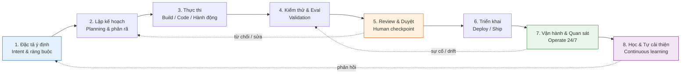

**Giải thích từng pha:**

- **(1) Đặc tả ý định** — viết rõ mục tiêu, tiêu chí "định nghĩa hoàn thành" (DoD), ràng buộc an toàn, ngân sách (token/thời gian/chi phí).
- **(2) Lập kế hoạch** — agent phân rã nhiệm vụ thành bước nhỏ, chọn tool, ước lượng rủi ro.
- **(3) Thực thi** — agent hành động: viết code / gọi API / thao tác dữ liệu.
- **(4) Kiểm thử & Eval** — chạy unit eval, kiểm tra máy-xác-minh-được, LLM-as-judge.
- **(5) Review & duyệt** — con người duyệt tại các điểm tác động cao (HITL).
- **(6) Triển khai** — ship có cổng chất lượng (eval-gated release).
- **(7) Vận hành 24/7** — chạy liên tục, được giám sát qua trace + metrics.
- **(8) Học & tự cải thiện** — đúc kết từ kết quả, tinh chỉnh skill/prompt/memory.

---

## 3. Kiến trúc một AI agent vận hành liên tục

> [!NOTE]
> Để xem sơ đồ kiến trúc mở rộng và chi tiết hơn về các lớp kiểm soát, giám sát và tự khắc phục lỗi, xem [Sơ đồ Kiến trúc Vận hành 24/7 & Xử lý lỗi (Sơ đồ 4)](Agentic_SDLC_Master_Map.md#4-sơ-đồ-kiến-trúc-vận-hành-247-xử-lý-lỗi-247-operation-error-recovery-architecture).

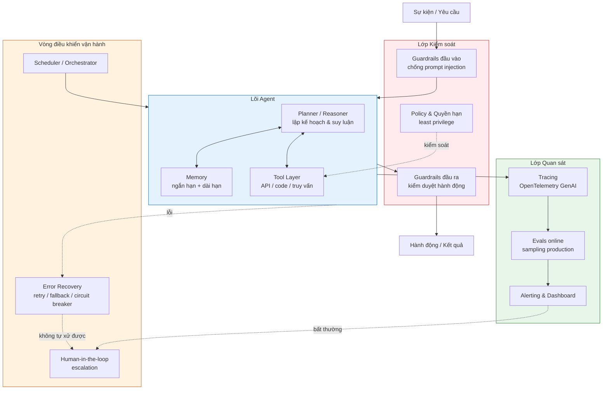

Bốn lớp tách bạch — **Lõi**, **Kiểm soát**, **Quan sát**, **Vòng vận hành** — là xương sống để agent chạy bền bỉ. Nguyên tắc: *lõi có thể sai, nhưng các lớp bao quanh phải bắt được cái sai đó.*

---

## 4. Vận hành 24/7 & cơ chế giám sát

### 4.1. Vì sao giám sát truyền thống (APM) không đủ

Đây là điểm mấu chốt cho mục tiêu "ổn định liên tục" của bạn:

> Một agent **loop vô hạn, gọi sai tool, hoặc bịa kết quả (hallucinate) vẫn có thể trả về phản hồi "thành công" với độ trễ bình thường.** Công cụ APM truyền thống nhìn vào latency/error-rate sẽ **không phát hiện** được các lỗi này.

Phần lớn sự cố agent đến từ **tool-call thất bại, context bị cắt cụt (truncation), và vòng lặp chạy hoang (runaway loop)** — chứ không phải lỗi của model. Do đó cần **agent-aware instrumentation** (đo đạc hiểu ngữ nghĩa agent).

### 4.2. Tracing: ghi lại toàn bộ chuỗi quyết định

Mỗi lần agent chạy phải sinh ra một **trace** ghi lại: tool nào được gọi, context nào được lấy, agent suy luận qua từng bước ra sao, và output cuối có đạt ngưỡng chất lượng không.

**Khuyến nghị kỹ thuật:**
- Dùng **OpenTelemetry semantic conventions for GenAI** để trace *vendor-agnostic* (không khóa cứng vào một nhà cung cấp, dễ đổi/chồng nền tảng).
- Dùng native adapter cho framework đang dùng (OpenAI Agents SDK, LangGraph, Mastra, Pydantic AI, LangChain, CrewAI, Vercel AI SDK); với stack tự xây thì OTel là fallback. Cả hai phải xuất trace **cùng một schema**.

### 4.3. Ba "tín hiệu sống" cần theo dõi liên tục

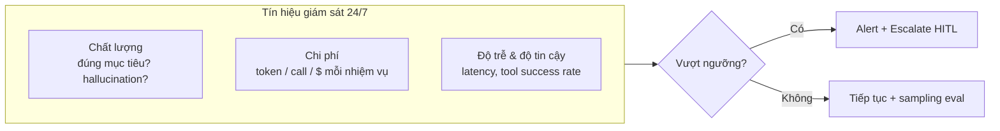

| Nhóm tín hiệu | Ví dụ chỉ số | Vì sao quan trọng |
|---|---|---|
| **Chất lượng** | tỉ lệ hoàn thành nhiệm vụ, tỉ lệ hallucination, độ trôi (drift) | bắt lỗi "thành công giả" |
| **Chi phí** | token/nhiệm vụ, số tool-call, $ /ngày | tránh "đốt tiền" khi chạy 24/7 |
| **Độ tin cậy** | tool-call success rate, số lần loop, độ sâu retry | bắt runaway loop & tool fail |

### 4.4. Error recovery — để agent "tự đứng dậy"

Để chạy liên tục không cần người trực, agent cần các cơ chế phục hồi:

- **Retry có giới hạn + backoff:** thử lại tool fail, nhưng có trần để tránh loop.
- **Fallback:** đổi tool/model/route khác khi đường chính hỏng.
- **Circuit breaker:** ngắt mạch khi một dependency liên tục lỗi, tránh lan rộng.
- **Loop/budget guard:** giới hạn số bước, token, thời gian cho một nhiệm vụ; vượt thì dừng & escalate.
- **Checkpoint & resume:** lưu trạng thái để khôi phục sau gián đoạn (đặc biệt với nhiệm vụ dài nhiều ngày).
- **Escalation tới con người:** khi agent không tự xử được, chuyển cho HITL thay vì "đoán bừa".

### 4.5. Orchestration cho hoạt động liên tục

Các hành vi giá trị cao nhất — **học liên tục, ngữ cảnh bền vững, thực thi 24/7** — *không tương thích* với mô hình chạy cục bộ kiểu bật-tắt. Vận hành 24/7 nên dựa trên **thiết kế cloud-native**: scheduler kích hoạt nhiệm vụ theo lịch/sự kiện, memory bền vững xuyên phiên, và state được lưu trữ tập trung.

---

## 5. Đánh giá & chất lượng — làm sao đạt "xuất sắc nhất"

Chất lượng agentic không đến từ một lần test, mà từ **hệ thống đánh giá nhiều lớp, chạy liên tục**.

### 5.1. Ba lớp đánh giá bắt buộc

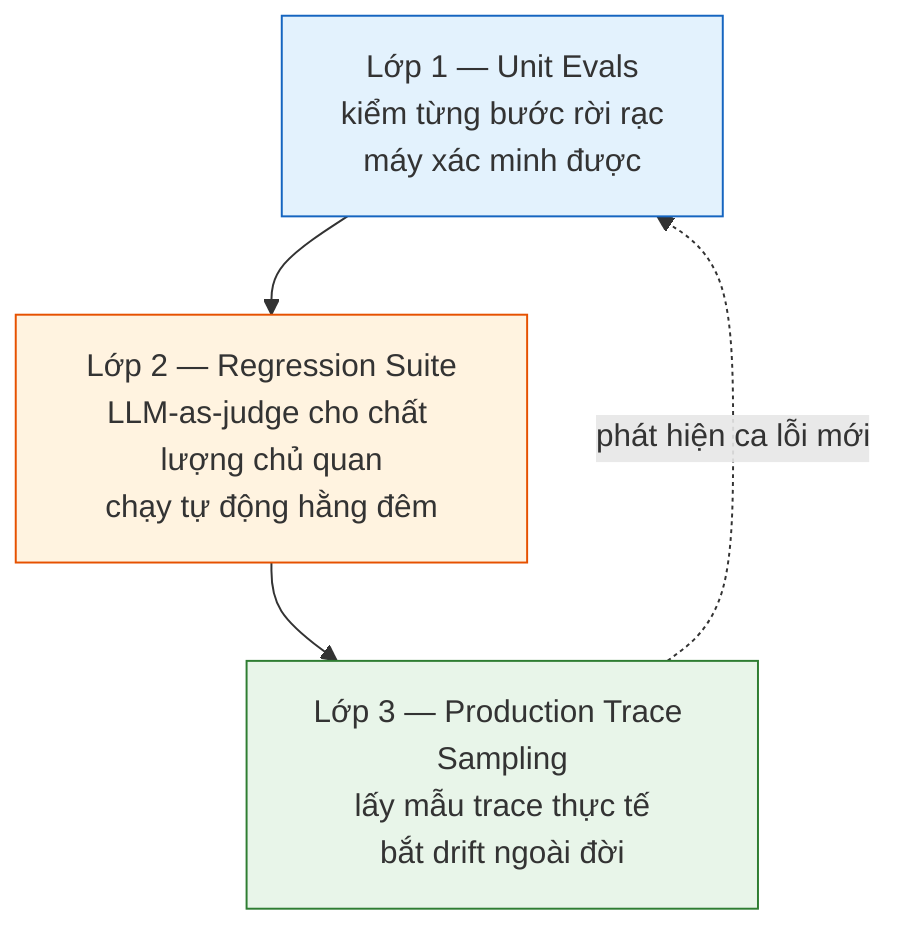

1. **Unit evals** — kiểm các bước rời rạc bằng cách *máy xác minh được* (deterministic checks): đúng định dạng, gọi đúng tool, kết quả khớp ground-truth.
2. **LLM-as-judge regression suite** — dùng một LLM mạnh chấm chất lượng *chủ quan* (mạch lạc, hữu ích, đúng ý định) cho các output khó định lượng; chạy **regression tự động hằng đêm**.
3. **Production trace sampling liên tục** — lấy mẫu trace thật để bắt **drift** mà bộ test offline không thấy. Đây là vòng phản hồi đưa ca lỗi mới về làm test case.

### 5.2. LLM-as-judge: mạnh nhưng phải kỷ luật

- **Bản chất:** dùng một LLM mạnh để chấm/xếp hạng output của agent, mô phỏng người đánh giá — cho phép **đánh giá ở quy mô lớn**.
- **Giới hạn quan trọng:** judge cũng có thiên lệch. **Không được thay thế hoàn toàn con người.** Phải *meta-evaluate* chính judge (kiểm tra judge có chấm đúng không).
- **Best practice — đánh giá lai (hybrid):** kết hợp **kiểm tra tất định/thống kê** + **LLM-as-judge**, tránh phụ thuộc vào một thước đo duy nhất. Dùng **review người có mục tiêu trên các luồng tác động cao** để *hiệu chỉnh (calibrate)* judge cho khớp chuẩn sản phẩm.
- Một biến thể mới là **Agent-as-a-Judge**: dùng chính agent để đánh giá agent, bổ trợ (không thay thế) giám sát con người.

### 5.3. Cổng chất lượng trong CI/CD (eval-gated release)

Để chất lượng không tụt khi cập nhật:

- Chạy eval **tự động trên mỗi thay đổi code** (ví dụ tích hợp GitHub Actions).
- **Chặn (gate) release** nếu thay đổi làm *giảm* điểm chất lượng so với baseline.
- Báo cáo regression hằng đêm để phát hiện sớm sa sút.

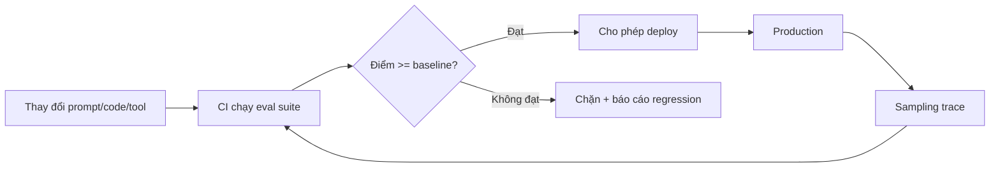

### 5.4. Taxonomy "đo cái gì"

Một kỷ luật quan trọng: có **bảng phân loại rõ ràng về cái cần đo**. Gợi ý các chiều:
- **Task success** (hoàn thành đúng mục tiêu)
- **Trung thực / không bịa** (faithfulness, grounding)
- **Tuân thủ quy trình** (gọi đúng tool theo đúng thứ tự)
- **An toàn** (không vi phạm policy)
- **Hiệu quả** (chi phí/độ trễ hợp lý)
- **Trải nghiệm** (mạch lạc, đúng giọng điệu).

---

## 6. Kiểm soát & an toàn (Governance)

### 6.1. OWASP Top 10 for Agentic Applications (bản 2025/2026)

Khung rủi ro tham chiếu hàng đầu cho agent. Bản 2026 tập trung vào các thất bại từ *goal misalignment, tool misuse, delegated trust, giao tiếp giữa các agent, bộ nhớ bền vững, và hành vi tự trị nổi lên (emergent)*. Một số rủi ro tiêu biểu:

| Rủi ro | Mô tả ngắn | Biện pháp giảm thiểu |
|---|---|---|
| **Agent Goal Hijack** | mục tiêu bị chiếm/lệch hướng | đặc tả ý định rõ, kiểm tra mục tiêu định kỳ |
| **Tool Misuse & Exploitation** | lạm dụng/khai thác tool | allowlist tool, sandbox, xác thực tham số |
| **Identity & Privilege Abuse** | lạm quyền danh tính | least privilege, scoped credentials, audit |
| **Prompt Injection** | input độc chiếm điều khiển | guardrails đầu vào, tách dữ liệu khỏi lệnh |
| **Excessive Agency** | agent được trao quá nhiều quyền tự quyết | giới hạn hành động, HITL cho hành động rủi ro |
| **Insecure Output Handling** | output không kiểm duyệt gây hại | guardrails đầu ra, kiểm tra trước khi thực thi |
| **Memory Poisoning** | đầu độc bộ nhớ dài hạn | xác thực nguồn ghi vào memory, cách ly |

> Nguyên tắc thực hành: **ánh xạ từng rủi ro OWASP sang một biện pháp eval/guardrail/alert cụ thể.** Mỗi rủi ro phải có "người gác cổng".

### 6.2. Guardrails — hai tầng

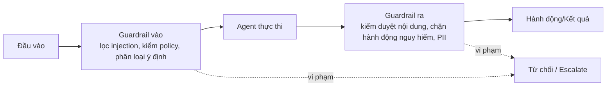

### 6.3. Quản trị quyền hạn & danh tính

- **Least privilege:** agent chỉ có đúng tool & quyền tối thiểu cho nhiệm vụ.
- **Scoped, short-lived credentials:** token có phạm vi hẹp, hết hạn nhanh.
- **Phân tách môi trường:** sandbox cho hành động rủi ro; production tách biệt.
- **Audit trail bất biến:** mọi hành động ghi log không sửa được để truy vết & tuân thủ.
- **Human approval cho hành động không thể hoàn tác:** xóa dữ liệu, chuyển tiền, gửi ra ngoài… phải qua duyệt.

### 6.4. Con người ở đâu trong vòng lặp? (HITL)

HITL là *không thể thiếu* cho các kịch bản tác động cao. Vai trò con người:
- Đánh giá **chuỗi suy luận** của agent và sự *mạch lạc của workflow nhiều bước*.
- Kiểm tra **khớp với yêu cầu nghiệp vụ**.
- **Hiệu chỉnh judge** và chuẩn chất lượng qua review có mục tiêu trên luồng tác động cao.

Cách bố trí HITL theo mức rủi ro:

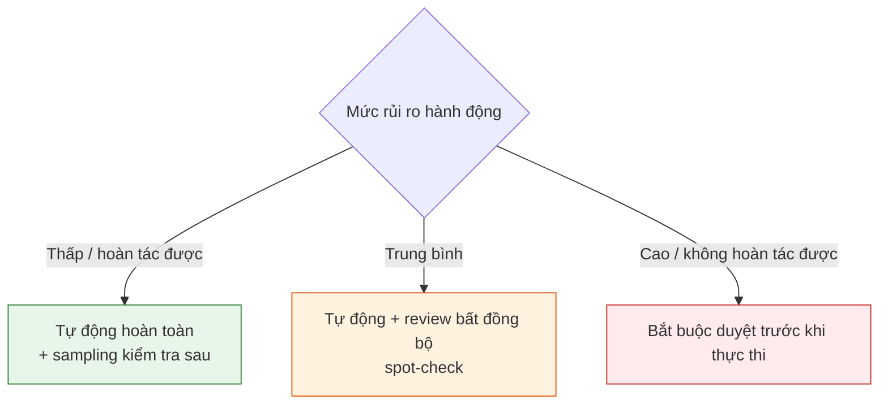

---

## 7. Tự cải thiện (Self-improvement)

> [!NOTE]
> Xem chi tiết sơ đồ luồng dữ liệu, đánh giá sandbox và cơ chế triển khai của quy trình này tại [Sơ đồ Vòng lặp Tự cải thiện liên tục (Sơ đồ 5)](Agentic_SDLC_Master_Map.md#5-sơ-đồ-vòng-lặp-tự-cải-thiện-liên-tục-continuous-self-improvement-loop).

Mục tiêu "tự cải thiện" của bạn đã có nhiều hướng *đang chạy thực tế trong 2026*:

- **Tinh chỉnh skill theo kết quả:** agent tạo & tinh chỉnh "kỹ năng" riêng dựa trên kết quả nhiệm vụ; quan sát thấy hiệu năng *cải thiện theo tuần* trên các loại nhiệm vụ lặp lại.
- **Hướng tiến hóa (evolutionary):** AlphaEvolve, ShinkaEvolve — tiến hóa lời giải/chiến lược.
- **Học tăng cường (RL):** SWE-RL, SAGE — học từ phần thưởng/kết quả.
- **Hệ thống bộ nhớ (memory):** Mem0, MemOS, SimpleMem — tích lũy & tái dùng kinh nghiệm.

Bằng chứng quy mô: một framework "Deep Researcher Agent" đã hoàn thành **500+ chu kỳ thí nghiệm** trên 4 dự án song song trong **hơn 30 ngày**, đạt **~52% cải thiện so với baseline** — minh chứng cho vòng lặp tự cải thiện chạy liên tục.

### 7.1. Vòng lặp tự cải thiện an toàn

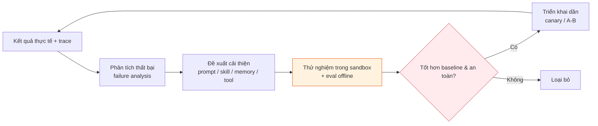

> Cảnh báo: tự cải thiện *không kiểm soát* là rủi ro (emergent behavior, memory poisoning). Mọi thay đổi tự sinh phải đi qua **eval + sandbox + canary** trước khi vào production.

---

## 8. Áp dụng cho hai bối cảnh

### 8.1. Coding agents (phát triển phần mềm)
Agent làm *first-pass executor*: phân tích khả thi khi planning, viết feature khi build, mở rộng test coverage khi validate, nêu rủi ro khi review — nén thời gian từ tuần xuống ngắn hơn. Công cụ phổ biến 2026: Claude Code, Cursor, GitHub Copilot Agent, Codex, Gemini Code Assist (đa số đội dùng *kết hợp nhiều công cụ*). Quản trị bằng: PR review bắt buộc, eval-gated CI, test sinh tự động, branch sandbox.

### 8.2. Agent nghiệp vụ (business/ops)
Cùng khung vòng đời, nhưng "build" = thực hiện quy trình nghiệp vụ (xử lý đơn, phân loại email, đối soát dữ liệu…). Khác biệt: hành động thường *tác động trực tiếp tới hệ thống thật & tiền*, nên **HITL cho hành động không hoàn tác** và **audit trail** càng quan trọng. Cùng triết lý: đặc tả ý định → eval nhiều lớp → observability → governance.

---

## 9. Lộ trình triển khai (maturity ladder)

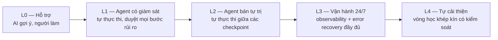

**Thứ tự nên xây (đừng nhảy cóc):**
1. **Observability trước** — không thấy thì không kiểm soát được. Dựng tracing (OTel) + dashboard 3 tín hiệu.
2. **Eval suite** — unit + LLM-as-judge + sampling; cắm vào CI làm cổng chất lượng.
3. **Guardrails & governance** — ánh xạ OWASP, least privilege, HITL theo mức rủi ro.
4. **Error recovery & orchestration** — retry/fallback/circuit breaker/budget guard cho 24/7.
5. **Self-improvement** — chỉ bật sau khi 4 lớp trên vững, và luôn qua sandbox + canary.

---

## 10. Checklist "sản xuất sẵn sàng" (production-ready)

**Quan sát**
- [ ] Mọi run sinh trace đầy đủ chuỗi quyết định (OTel GenAI semantic conventions).
- [ ] Dashboard theo dõi 3 nhóm: chất lượng, chi phí, độ tin cậy.
- [ ] Alert khi vượt ngưỡng → escalate HITL.

**Đánh giá**
- [ ] 3 lớp eval: unit (deterministic) + LLM-as-judge regression hằng đêm + sampling production.
- [ ] Eval-gated CI: chặn release làm tụt điểm.
- [ ] Meta-evaluate judge; review người hiệu chỉnh trên luồng tác động cao.

**Vận hành 24/7**
- [ ] Retry+backoff, fallback, circuit breaker, budget/loop guard.
- [ ] Checkpoint & resume cho nhiệm vụ dài.
- [ ] Thiết kế cloud-native, memory & state bền vững.

**Kiểm soát & an toàn**
- [ ] Ánh xạ từng rủi ro OWASP Agentic → guardrail/eval/alert.
- [ ] Guardrails đầu vào & đầu ra.
- [ ] Least privilege, scoped credentials, audit trail bất biến.
- [ ] HITL bắt buộc cho hành động không hoàn tác.

**Tự cải thiện**
- [ ] Failure analysis tự động từ trace.
- [ ] Thay đổi tự sinh đi qua sandbox + eval + canary trước production.

---

---

# PHẦN II — Enterprise Agentic Delivery Playbook

> Phần I giải thích nền tảng Agentic SDLC. Phần II chuyển các phản biện thực tế thành **playbook vận hành được** cho phần mềm lớn, nhiều nghiệp vụ, có UI/UX phức tạp và nhiều agent cùng tham gia.

## 11. Đánh giá tổng quan & nguyên lý điều hành

Bốn ý kiến phản biện đều đúng, và đều chỉ vào cùng một rủi ro: nếu để agent "tự hiểu toàn cục", tự quyết định thiết kế, tự chia module, tự phối hợp với nhau thì chất lượng sẽ dao động mạnh. Agent có thể thực thi nhanh, nhưng không tự nhiên sở hữu được ý định sản phẩm, chuẩn thẩm mỹ, kiến trúc dài hạn, hay logic nghiệp vụ xuyên module.

| Điểm gãy | Đánh giá | Cơ chế kiểm soát bắt buộc |
|---|---|---|
| UI/UX agent khó làm chủ | **Rất đúng** | Design system, token, component contract, visual regression, designer checkpoint |
| Kiến trúc/module nhiều rủi ro | **Phải khóa trước khi build** | SDD, ADR, architecture freeze, debate review, threat modeling |
| Module lớn dễ rời rạc | **Không giải bằng prompt dài** | Domain boundary, interface contract, `AGENTS.md` phân tầng, contract test, E2E nghiệp vụ |
| Multi-agent song song dễ xung đột | **Tăng tốc nhưng phải điều phối** | Supervisor, worktree isolation, task ownership, merge gate, trace/cost budget |

**Nguyên lý trung tâm:**

> **Human owns intent, architecture, design standard, contracts; agents own execution inside constraints.**

Nói cách khác: con người sở hữu ý định, chuẩn thiết kế, kiến trúc, hợp đồng, quyết định một chiều và tiêu chí chất lượng. Agent chỉ nên thực thi bên trong các ràng buộc đó. Chất lượng không đến từ việc agent "thông minh hơn", mà từ việc biến các chuẩn chủ quan thành **nguồn sự thật máy-đọc-được** và **cổng kiểm soát tự động**.

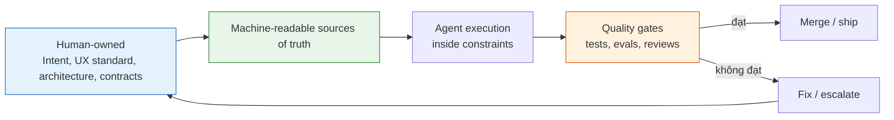

## 12. Quality Control Matrix — nối rủi ro với guardrail

> [!NOTE]
> Sơ đồ hóa toàn bộ các cổng chất lượng của doanh nghiệp được mô tả chi tiết tại [Bản đồ Cổng Kiểm soát Chất lượng Doanh nghiệp (Sơ đồ 6)](Agentic_SDLC_Master_Map.md#6-bản-đồ-cổng-kiểm-soát-chất-lượng-doanh-nghiệp-enterprise-quality-control-gates-map).

Bảng này là lớp điều hành mới cho Phần II: mỗi điểm gãy phải có nguồn sự thật, guardrail tự động, checkpoint con người và tiêu chí pass/fail rõ ràng.

| Khu vực | Nguồn sự thật | Guardrail tự động | Checkpoint con người | Pass/fail |
|---|---|---|---|---|
| **UI/UX** | Design tokens, component library, UX guidelines | Token linter, component-only rule, visual regression, accessibility checks | Designer/product review cho thay đổi thị giác lớn | Không hard-code style, không lệch baseline ngoài ngưỡng, đủ responsive/a11y/states |
| **Architecture** | Spec, ADR, architecture principles, threat model | Dependency rules, architecture tests, security scans, API schema checks | Architect + security + domain lead duyệt trước build | ADR được duyệt, ranh giới rõ, rollback path có, rủi ro chính có mitigation |
| **Module lớn** | Domain map, interface contracts, data ownership, `AGENTS.md` | Contract tests, integration tests, E2E flows, schema compatibility checks | Domain owner duyệt workflow nghiệp vụ xuyên module | Không phá contract, không nhập nhằng ownership, E2E nghiệp vụ đạt |
| **Multi-agent** | Task board, ownership map, branch/worktree policy, merge protocol | Isolated worktree, CI per branch, trace/cost/loop guard, merge gate | Supervisor/human lead duyệt phân việc và tích hợp | Không sửa chồng lấn, không merge khi test/eval fail, trace đầy đủ từng agent |

> Quy tắc vận hành: **mỗi rủi ro lớn phải có ít nhất một guardrail máy kiểm được và một checkpoint người duyệt được.** Nếu chỉ có hướng dẫn bằng lời, agent sẽ làm sai khi áp lực ngữ cảnh tăng.

## 13. UI/UX — từ thẩm mỹ chủ quan thành kiểm soát tất định

### 13.1. Rủi ro gốc

UI/UX là vùng agent dễ tạo ra nhiều chỉnh sửa nhất vì "đẹp", "đúng nhịp", "đồng nhất", "dễ hiểu" không có một đáp án duy nhất. Agent thường sai ở các điểm: spacing lệch chuẩn, typography không đồng bộ, màu không đúng token, component tự chế, thiếu trạng thái loading/error/empty, responsive vỡ ở breakpoint nhỏ, hoặc một màn hình nhìn ổn nhưng không khớp với hệ thống tổng thể.

### 13.2. Vì sao AI agent dễ sai

Agent nhìn UI qua mô tả rời rạc và ảnh chụp cục bộ, không tự có trí nhớ thị giác đầy đủ về toàn bộ sản phẩm. Nếu không có design system dạng máy-đọc-được, agent sẽ suy diễn từ vài ví dụ và tạo biến thể gần đúng. Kết quả là mỗi màn hình "hơi khác một chút"; tích lũy lại thành sản phẩm thiếu đồng nhất.

### 13.3. Quy trình đồng bộ Figma-to-Code toàn diện
Để đảm bảo AI Agent tuân thủ giao diện tuyệt đối, quy trình làm việc được cấu trúc thành một chuỗi tự động hóa và checkpoint nghiêm ngặt:

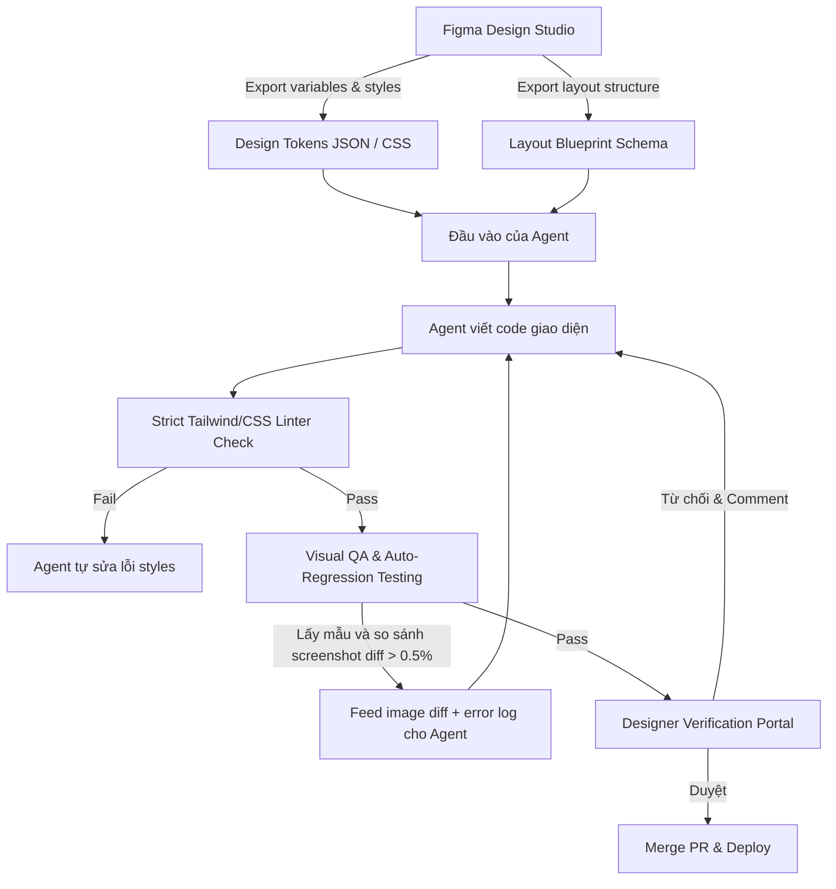

1. **Bước 1: Token hóa thiết kế (Design Tokenization):**
   - Màu sắc, khoảng cách (spacing), kiểu chữ (typography), bo góc (border radius), bóng đổ (shadow) được chốt trên Figma.
   - Sử dụng công cụ (như Figma Variables, Token Studio, Style Dictionary) để biên dịch tự động các biến thiết kế này thành định dạng máy đọc được (`tokens.json` hoặc biến CSS/Tailwind configuration). Các token này là **nguồn sự thật duy nhất** (Single Source of Truth).

2. **Bước 2: Lập sơ đồ cấu trúc layout (Layout Blueprint):**
   - Thay vì để agent tự thiết kế vị trí các phần tử, sơ đồ Figma được chuyển đổi thành cấu trúc DSL (Domain Specific Language) dạng JSON hoặc HTML skeleton định nghĩa cây phân cấp component, cấu trúc lưới (grid), và responsive breakpoint.

3. **Bước 3: Thực thi của Agent dưới ràng buộc cứng:**
   - Agent nhận `tokens.json` và Layout Blueprint cùng với danh mục các component đã được xây dựng sẵn.
   - Áp dụng nguyên tắc **Component-Only Rule**: Agent chỉ được sử dụng các nguyên mẫu component đã chốt trong hệ thống (Button, Input, Card, Modal, v.v.). Nghiêm cấm agent tự viết inline styles hoặc các class CSS tùy tiện ngoài danh mục token cho phép.

4. **Bước 4: Kiểm duyệt mã nguồn tự động (Linting Gate):**
   - Chạy linter cấu hình nghiêm ngặt (ví dụ: `eslint-plugin-tailwindcss` chặn các class tùy tiện như `h-[123px]`, `w-[54px]`, bắt buộc dùng tokens `h-12`, `w-24`).
   - Nếu phát hiện mã nguồn cứng (hard-coded hex color `#FF5733` hoặc spacing tùy tiện `margin-top: 13px`), linter sẽ chặn và trả lỗi về cho Agent tự sửa đổi ngay tại sandbox.

5. **Bước 5: Vòng lặp Visual QA & Hồi quy tự động (Automated Visual Regression Loop):**
   - CI/CD khởi động một headless browser (Playwright/Puppeteer) để render giao diện mới dưới nhiều kích thước màn hình (mobile, tablet, desktop) và các trạng thái (default, hover, active, focus, loading, error, empty).
   - Tiến hành so sánh ảnh chụp màn hình (screenshot) của giao diện thật với bản thiết kế mẫu được xuất tự động từ Figma API hoặc baseline cũ.
   - Nếu tỉ lệ khác biệt (diff) vượt quá **0.5%**, hệ thống sẽ tự động ghép ảnh diff màu đỏ, trích xuất mã CSS lỗi và gửi ngược lại cho Agent kèm yêu cầu: *"Giao diện lệch 3px padding ở góc trên bên phải, hãy sửa lại bằng cách áp dụng token spacing.md"*. Agent chạy vòng lặp sửa lỗi này tối đa 3 lần.

6. **Bước 6: Cổng xác nhận của Nhà thiết kế (Designer HITL Portal):**
   - Khi giao diện vượt qua vòng lặp QA tự động, một PR được đẩy lên cổng phê duyệt trực quan.
   - Nhà thiết kế thực tế (Human Designer) có thể click chọn giữa các trạng thái giao diện (loading, hover, error) để kiểm tra độ mượt mà.
   - Nếu từ chối, designer để lại feedback dạng hình ảnh và comment. Phản hồi này được chuyển trực tiếp vào Task Brief tiếp theo của Agent.

### 13.4. Các cơ chế kiểm soát tất định (Deterministic Controls)

- **Strict Class Name Allowlist:** Linter cấu hình chỉ cho phép import tokens từ thư viện chỉ định. Mọi cấu trúc CSS tùy biến ngoài config đều bị coi là lỗi compile.
- **State Matrix Verification:** Bộ test bắt buộc phải trigger tất cả các trạng thái tương tác (`:hover`, `:focus`, `:disabled`) và các kịch bản bất thường (dữ liệu rỗng - empty state, dữ liệu lỗi API - error state) để chụp screenshot kiểm chứng. Không bỏ sót bất kỳ trạng thái nào của giao diện.
- **Figma API Sync Schema:** Sử dụng ID phần tử Figma làm định danh (Figma Component Key) trong code để liên kết trực tiếp thiết kế Figma với component tương ứng trong mã nguồn, giúp tracking chính xác khi thiết kế thay đổi.

### 13.5. Tiêu chí pass/fail

- **Pass:** Không hard-code style, 100% styles sử dụng token, vượt qua linter Tailwind/CSS, screenshot diff dưới 0.5% ở tất cả 3 viewports và 5 trạng thái tương tác, được ký duyệt (sign-off) bởi Designer trên cổng HITL.
- **Fail:** Tự định nghĩa class mới, dùng hex color trực tiếp, lệch spacing token, vỡ layout responsive, thiếu trạng thái lỗi/tải (error/loading), hoặc visual diff vượt quá 0.5% mà chưa có phê duyệt ngoại lệ của Designer.

### 13.6. Checklist triển khai UI/UX

- [ ] Figma variables được đồng bộ tự động thành file tokens cấu hình trong dự án.
- [ ] Linter cài đặt rules chặn cứng inline-style và các class CSS tự do (non-token).
- [ ] Cấu hình visual regression test tự động trên CI (Playwright/Chromatic/Percy) tích hợp vòng phản hồi (feedback loop) cho Agent.
- [ ] Xây dựng ma trận kiểm tra đầy đủ trạng thái (default, hover, active, focus, loading, error, empty) cho mọi component mới.
- [ ] Thiết lập cổng HITL Designer Review Sign-off bắt buộc làm Gate cuối cùng trước khi merge PR.

## 14. Kiến trúc — khóa quyết định lớn trước khi agent build

### 14.1. Rủi ro gốc

Kiến trúc là nhóm quyết định có chi phí sửa sai rất cao. Một module boundary sai, data ownership mơ hồ, dependency ngược chiều, hoặc lựa chọn storage/eventing sai có thể làm toàn bộ hệ thống khó mở rộng sau này. Agent thường tối ưu để hoàn thành task trước mắt, nên dễ chọn giải pháp cục bộ mà không thấy hệ quả dài hạn.

### 14.2. Vì sao AI agent dễ sai

Agent bị giới hạn bởi context hiện có và mục tiêu ngắn hạn trong prompt. Nếu prompt yêu cầu "implement feature", agent sẽ ưu tiên code chạy được, đôi khi bỏ qua reversibility, migration path, operational cost, security boundary hoặc khả năng test. Vì vậy kiến trúc phải là **đầu vào đã duyệt**, không phải kết quả phụ trong lúc coding.

### 14.3. Cơ chế kiểm soát: Architecture Freeze Before Agent Build

Trước khi agent implement, phải có cổng **Architecture Freeze Before Agent Build**. "Freeze" không có nghĩa là không bao giờ đổi, mà là mọi quyết định kiến trúc quan trọng đã được ghi lại, phản biện, duyệt và có đường quay lại nếu giả định sai.

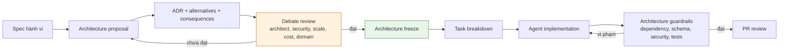

Mẫu ADR tối thiểu:

| Mục | Nội dung bắt buộc |
|---|---|
| **Context** | Vấn đề, ràng buộc, yêu cầu phi chức năng, giả định |
| **Decision** | Quyết định được chọn và phạm vi áp dụng |
| **Alternatives** | Các phương án bị loại và lý do |
| **Consequences** | Tác động tới scale, cost, security, testability, vận hành |
| **Rollback path** | Cách đảo quyết định hoặc giảm thiệt hại nếu sai |

### 14.4. Review đa vai

Mỗi quyết định kiến trúc quan trọng nên được phản biện bởi các vai sau, có thể là người thật hoặc agent đóng vai, nhưng người chịu trách nhiệm cuối phải là architect/human lead:

- **Architect:** ranh giới module, coupling, dependency direction, extensibility.
- **Security:** threat model, privilege boundary, data exposure, audit trail.
- **Scalability:** throughput, latency, state, queueing, cache, bottleneck.
- **Maintainability:** cognitive load, testability, migration, versioning.
- **Cost:** chi phí hạ tầng, token/tool calls, vận hành 24/7.
- **Domain expert:** logic nghiệp vụ, exception flow, compliance, thuật ngữ.

### 14.5. Tiêu chí pass/fail

- Pass nếu spec rõ, ADR được duyệt, module boundary và data ownership rõ, dependency direction kiểm được, threat model có mitigation, rollback path tồn tại, test strategy gắn với kiến trúc.
- Fail nếu agent phải tự quyết định storage, event schema, API boundary, permission model, hoặc dependency giữa module trong lúc implement.

### 14.6. Checklist triển khai kiến trúc

- [ ] Spec được duyệt trước khi lập task.
- [ ] ADR tồn tại cho mọi quyết định khó đảo.
- [ ] Architecture review đa vai hoàn tất.
- [ ] Dependency rules hoặc architecture tests nằm trong CI.
- [ ] Threat model và quyền hạn được ánh xạ sang guardrail.
- [ ] Không giao task implement khi boundary/interface còn mơ hồ.

## 15. Module lớn — chia nhỏ theo domain mà không mất logic

### 15.1. Rủi ro gốc

Với phần mềm lớn, nhiều nghiệp vụ, rủi ro không nằm ở việc agent viết được từng mảnh code hay không. Rủi ro nằm ở việc các mảnh đó không khớp với nhau: cùng một khái niệm nghiệp vụ bị định nghĩa khác nhau, dữ liệu có nhiều owner, workflow đứt ở biên module, lỗi không được propagate đúng, hoặc thay đổi một module làm vỡ module khác mà test đơn vị không bắt được.

### 15.2. Vì sao AI agent dễ sai

Không một prompt đơn lẻ nào giữ được toàn bộ bức tranh của hệ thống lớn. Nếu chia task theo màn hình hoặc theo file kỹ thuật, agent có thể tối ưu từng phần nhưng làm mất logic domain. Cách chia đúng là chia theo **bounded context/domain capability**, sau đó khóa bằng contract.

### 15.3. Cơ chế kiểm soát: domain boundary + interface contract

Mỗi module lớn phải có contract rõ trước khi agent sửa code. Contract không chỉ là API endpoint; nó là hợp đồng vận hành giữa các phần của hệ thống.

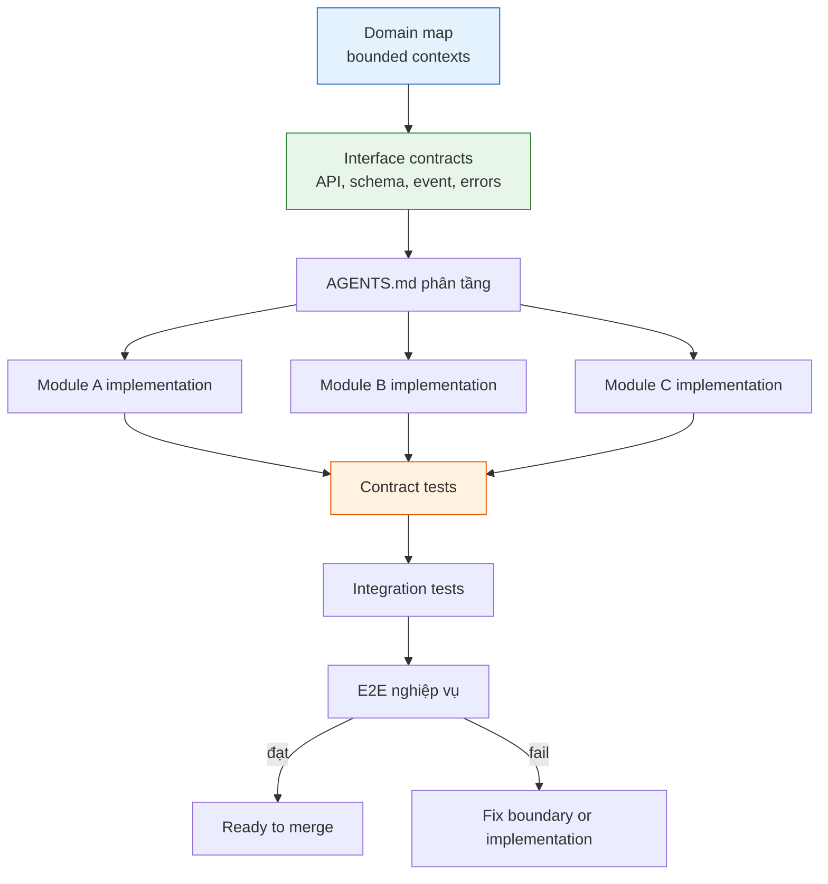

Một module contract tối thiểu cần có:

- **Domain responsibility:** module sở hữu năng lực nghiệp vụ nào, không sở hữu gì.
- **API/schema/event:** đầu vào, đầu ra, versioning, backward compatibility.
- **Data ownership:** bảng/collection/entity nào thuộc module, ai được ghi, ai chỉ được đọc.
- **Error model:** lỗi nghiệp vụ, lỗi kỹ thuật, retryability, idempotency.
- **Security boundary:** quyền cần có, dữ liệu nhạy cảm, audit requirement.
- **Test contract:** consumer-driven contract tests, integration tests, E2E flows liên quan.

### 15.4. `AGENTS.md` phân tầng như bản đồ vận hành cho agent

`AGENTS.md` nên phản chiếu cấu trúc hệ thống:

- Repo root: nguyên tắc toàn cục, coding standard, test command, security rules.
- Domain/module: mục tiêu nghiệp vụ, boundary, contract, thuật ngữ, dependency allowed/forbidden.
- Package/submodule: hướng dẫn local, test cụ thể, convention, known pitfalls.

Agent đọc file gần phạm vi đang sửa nhất, nhưng vẫn bị ràng buộc bởi nguyên tắc ở cấp cao hơn. Đây là cách giữ ngữ cảnh đủ nhỏ để agent xử lý, nhưng vẫn không mất liên kết toàn cục.

### 15.5. Tiêu chí pass/fail

- Pass nếu mỗi module có owner, boundary, contract, test và E2E flow rõ; thay đổi module không phá consumer; thuật ngữ nghiệp vụ dùng nhất quán.
- Fail nếu task chỉ ghi "làm màn hình X" mà không xác định domain owner, data owner, contract, error flow, hoặc E2E nghiệp vụ.

### 15.6. Checklist triển khai module lớn

- [ ] Có domain map/bounded context trước khi chia task.
- [ ] Mỗi module có contract về API/schema/event/data/error/security.
- [ ] `AGENTS.md` tồn tại ở root và module quan trọng.
- [ ] Contract tests chạy ở mọi biên module.
- [ ] E2E flows đại diện cho nghiệp vụ thật, không chỉ test kỹ thuật.
- [ ] Mỗi bug production tạo thêm một test/eval hồi quy.

## 16. Multi-agent — song song tốc độ cao nhưng không mất kiểm soát

### 16.1. Rủi ro gốc

Multi-agent tăng tốc vì nhiều luồng thực thi chạy cùng lúc, nhưng cũng nhân rủi ro: hai agent sửa cùng file, hai cách hiểu khác nhau về cùng một contract, test bị viết trùng hoặc hở, style lệch giữa nhánh, chi phí tăng nhanh, và merge cuối cùng trở thành điểm nghẽn.

### 16.2. Vì sao AI agent dễ sai

Mỗi agent có context riêng và tối ưu cho task riêng. Nếu không có supervisor, ownership map và merge protocol, các agent sẽ tạo ra nhiều lời giải cục bộ nhưng khó tích hợp. Song song chỉ có giá trị khi các ranh giới đã rõ và chất lượng được kiểm ở điểm hợp nhất.

### 16.3. Kiến trúc Multi-Agent hướng Domain song song (Domain-Driven Multi-Agent - DDMA)

Để tăng tốc độ phát triển cho phần mềm nhiều nghiệp vụ, hệ thống phức tạp mà vẫn bảo đảm tính đồng bộ logic và ranh giới hệ thống, chúng tôi áp dụng kiến trúc DDMA.

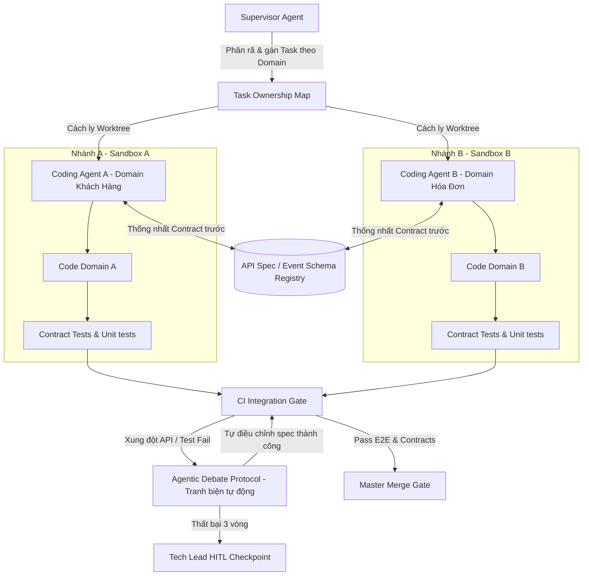

#### 16.3.1. Nguyên tắc cách ly không gian làm việc (Workspace Isolation)
- **Domain Bound Worktrees:** Mỗi agent làm việc trên một nhánh git và Git Worktree hoàn toàn cô lập.
- **File Access Lock:** Phân quyền sửa đổi tệp dựa trên cấu trúc thư mục của Bounded Context (DDD). Agent phụ trách domain *Hóa Đơn* bị cấm tuyệt đối bởi git pre-commit hook không cho phép sửa đổi mã nguồn nằm trong thư mục của domain *Khách Hàng*.
- **Database Schema Lock:** Database schema được cố định trước khi phân công. Agent không được tự ý sửa database schema khi chưa có migration file được duyệt trước bởi Architect (Con người).

#### 16.3.2. Cơ chế Contract-First và Khóa Tích hợp (Integration Lock)
- **API & Event Specs as Hard Gates:** Trước khi thực thi viết logic, các sub-agents bắt buộc phải giao tiếp thông qua một registry chung để thống nhất interface: API Spec (OpenAPI/GraphQL/Protobuf) hoặc Event Schema (Avro/JSON Schema).
- **Consumer-Driven Contract Testing (Pact):** Mọi thay đổi ở client hoặc server đều phải chạy qua bộ kiểm thử contract. Nếu domain A thay đổi kiểu dữ liệu trả về của một trường làm ảnh hưởng đến domain B, Pact test sẽ lập tức báo đỏ và chặn merge.

#### 16.3.3. Cơ chế tự động giải quyết xung đột (Agentic Debate Protocol)
Khi phát hiện xung đột hoặc lỗi kiểm thử contract giữa hai domain chạy song song:
1. **Khởi chạy Nghị trình Tranh biện (Start Debate):** Agent Supervisor sẽ tự động khóa hai nhánh và kéo hai Agent liên quan vào một phiên chat nội bộ (Debate Room).
2. **Đối thoại Spec (Context Sharing):** Supervisor cung cấp chi tiết lỗi test Pact, log lỗi, và specs hiện tại của hai bên.
3. **Căn chỉnh tự động (Auto-Reconciliation):** Các sub-agents sẽ đưa ra lý do, đề xuất chỉnh sửa schema hoặc đổi tên trường dữ liệu. Quy trình này lặp lại tối đa 3 vòng.
4. **Phê duyệt hoặc Leo thang (Escalation):** Nếu tự căn chỉnh thành công và test pass, Supervisor ghi nhận spec mới và tiếp tục chạy CI. Nếu sau 3 vòng vẫn xung đột logic nghiệp vụ sâu, Supervisor sẽ đóng băng task và gửi cảnh báo đỏ lên Technical Lead (Con người) để phân xử.

### 16.4. Phân vai Claude, Codex, Gemini

| Công cụ | Vai trò phù hợp | Không nên giao |
|---|---|---|
| **Claude** | Reasoning sâu, kiến trúc, phản biện, planning, review chất lượng, điều phối Debate Room | Tự ý quyết kiến trúc nếu chưa có human approval |
| **Codex** | Implementation, refactor có phạm vi rõ, viết test, sửa lỗi cục bộ trong Sandbox | Tự mở rộng scope hoặc sửa chồng lấn nhiều module |
| **Gemini** | Đọc ngữ cảnh lớn, phân tích tài liệu/codebase rộng, đa phương thức, kiểm tra sự đồng nhất logic toàn cục | Merge cuối hoặc quyết định contract khi chưa được duyệt |

### 16.5. Quy trình song song an toàn

1. **Khóa Spec & Contract trước:** Xác định API/Event spec và lưu vào Schema Registry.
2. **Lập Task Ownership Map:** Phân định rõ ranh giới thư mục hoạt động cho từng Agent.
3. **Phân phối Isolated Worktrees:** Kích hoạt các agent thực thi độc lập trên sandbox.
4. **Chạy Contract Tests trên từng Branch:** Đảm bảo nhánh riêng luôn xanh với contract chung.
5. **Kích hoạt Agentic Debate:** Khi có xung đột API, tự động đối thoại để sửa đổi spec.
6. **Master Merge Gate:** Con người (Tech Lead) duyệt PR chỉ khi 100% unit tests, contract tests, và E2E nghiệp vụ thành công.

### 16.6. Tiêu chí pass/fail

- **Pass:** Mỗi agent đi đúng domain boundary, không sửa file ngoài danh mục phân quyền, 100% Contract Tests và Integration Tests đạt yêu cầu, giải quyết xung đột qua Debate Room thành công hoặc được Tech Lead ký duyệt.
- **Fail:** Tự sửa mã nguồn của domain khác, thay đổi database schema ngoài kế hoạch, không qua được Pact test, hoặc xảy ra xung đột API mà không giải quyết được và trôi nổi không báo cáo.

### 16.7. Checklist triển khai multi-agent

- [ ] Có supervisor/human lead chịu trách nhiệm phân việc và merge.
- [ ] Thiết lập Git pre-commit hooks chặn sửa đổi tệp ngoài domain boundary được gán.
- [ ] Chốt toàn bộ API/Event contracts trước khi chia nhánh cho agents.
- [ ] Cài đặt framework Contract Testing (như Pact) tích hợp vào luồng CI của từng nhánh.
- [ ] Cấu hình Agentic Debate Protocol tự động giải quyết xung đột giao tiếp API.
- [ ] Merge chỉ sau khi tất cả các kiểm thử unit, contract, integration và E2E đều đạt chỉ số xanh.

## 17. Checklist enterprise sau khi bổ sung Phần II

**UI/UX**
- [ ] Agent không tạo UI ngoài design system nếu chưa có approval.
- [ ] Token, component, visual regression, accessibility, responsive checks đều có trong pipeline.
- [ ] Designer checkpoint áp dụng cho layout/component/interaction mới.

**Kiến trúc**
- [ ] Architecture Freeze Before Agent Build được áp dụng cho quyết định lớn.
- [ ] ADR có context, decision, alternatives, consequences, rollback path.
- [ ] Review đa vai bao gồm architect, security, scalability, maintainability, cost, domain expert.

**Module lớn**
- [ ] Chia theo bounded context/domain capability, không chỉ theo màn hình.
- [ ] Mỗi module có contract về API/schema/event/data ownership/error model/security.
- [ ] `AGENTS.md` phân tầng giúp agent giữ đúng ngữ cảnh local và nguyên tắc global.

**Multi-agent**
- [ ] Supervisor + isolated sub-agents là mô hình mặc định.
- [ ] Claude/Codex/Gemini được phân vai theo điểm mạnh, không dùng thay human approval.
- [ ] Worktree isolation, ownership map, CI per branch và merge gate là bắt buộc.

> **Ba nguyên tắc vàng sau khi nâng cấp tài liệu:**
> 1. *Con người sở hữu intent, architecture, design standard, contracts; agent sở hữu execution trong ràng buộc.*
> 2. *Biến chuẩn chủ quan thành guardrail máy kiểm được: token, component contract, screenshot diff, ADR, contract test, eval.*
> 3. *Tốc độ multi-agent chỉ có giá trị khi tích hợp được; tích hợp được nhờ boundary, ownership, isolation và merge gate.*

---

## Nguồn tham khảo

- [Agentic SDLC: How AI agents are changing SDLC — CodeRabbit](https://www.coderabbit.ai/guides/agentic-sdlc)
- [Agentic SDLC: What Changes When Agents Run Development — Augment Code](https://www.augmentcode.com/guides/agentic-sdlc)
- [Agentic Development Lifecycle (ADLC): A New Model Beyond SDLC — EPAM](https://www.epam.com/insights/ai/blogs/agentic-development-lifecycle-explained)
- [How agentic AI will reshape engineering workflows in 2026 — CIO](https://www.cio.com/article/4134741/how-agentic-ai-will-reshape-engineering-workflows-in-2026.html)
- [An AI-led SDLC: End-to-End Agentic SDLC with Azure and GitHub — Microsoft Community Hub](https://techcommunity.microsoft.com/blog/appsonazureblog/an-ai-led-sdlc-building-an-end-to-end-agentic-software-development-lifecycle-wit/4491896)
- [Agentic AI Software Development Lifecycle: Secure ADLC Playbook — Codebridge](https://www.codebridge.tech/articles/agentic-ai-software-development-lifecycle-the-production-ready-playbook)
- [What is Agentic SDLC — Sonar](https://www.sonarsource.com/resources/library/what-is-agentic-sdlc/)
- [State of AI Agents 2026: Governance, Evaluation and Scale — Lovelytics](https://lovelytics.com/post/state-of-ai-agents-2026-lessons-on-governance-evaluation-and-scale/)
- [Agent observability: The complete guide for 2026 — Braintrust](https://www.braintrust.dev/articles/agent-observability-complete-guide-2026)
- [Agent Observability 2026: Evals, Traces, Cost Guide — Digital Applied](https://www.digitalapplied.com/blog/agent-observability-2026-evals-traces-cost-guide)
- [Best AI Observability Tools for Autonomous Agents in 2026 — Arize](https://arize.com/blog/best-ai-observability-tools-for-autonomous-agents-in-2026/)
- [Running Automated Evals for AI Agents — DEV Community](https://dev.to/kuldeep_paul/running-automated-evals-for-ai-agents-a-practical-guide-for-engineering-and-product-teams-3pb8)
- [Agentic AI evaluation strategies — Vector Institute](https://vectorinstitute.ai/agentic-ai-evaluation-strategies/)
- [Evaluating AI agents: Real-world lessons at Amazon — AWS](https://aws.amazon.com/blogs/machine-learning/evaluating-ai-agents-real-world-lessons-from-building-agentic-systems-at-amazon/)
- [Agent-as-a-Judge: Evaluate Agents with Agents — arXiv](https://arxiv.org/pdf/2410.10934)
- [OWASP Top 10 for Agentic Applications 2026 — DeepTeam / Confident AI](https://www.trydeepteam.com/docs/frameworks-owasp-top-10-for-agentic-applications)
- [OWASP Top 10 Agents & AI Vulnerabilities (2026 Cheat Sheet)](https://blog.alexewerlof.com/p/owasp-top-10-ai-llm-agents)
- [Self-Improving AI Agents: The 2026 Guide — o-mega](https://o-mega.ai/articles/self-improving-ai-agents-the-2026-guide)
- [Top 5 AI Agent Monitoring Platforms in 2026 — Maxim AI](https://www.getmaxim.ai/articles/top-5-ai-agent-monitoring-platforms-in-2026/)
