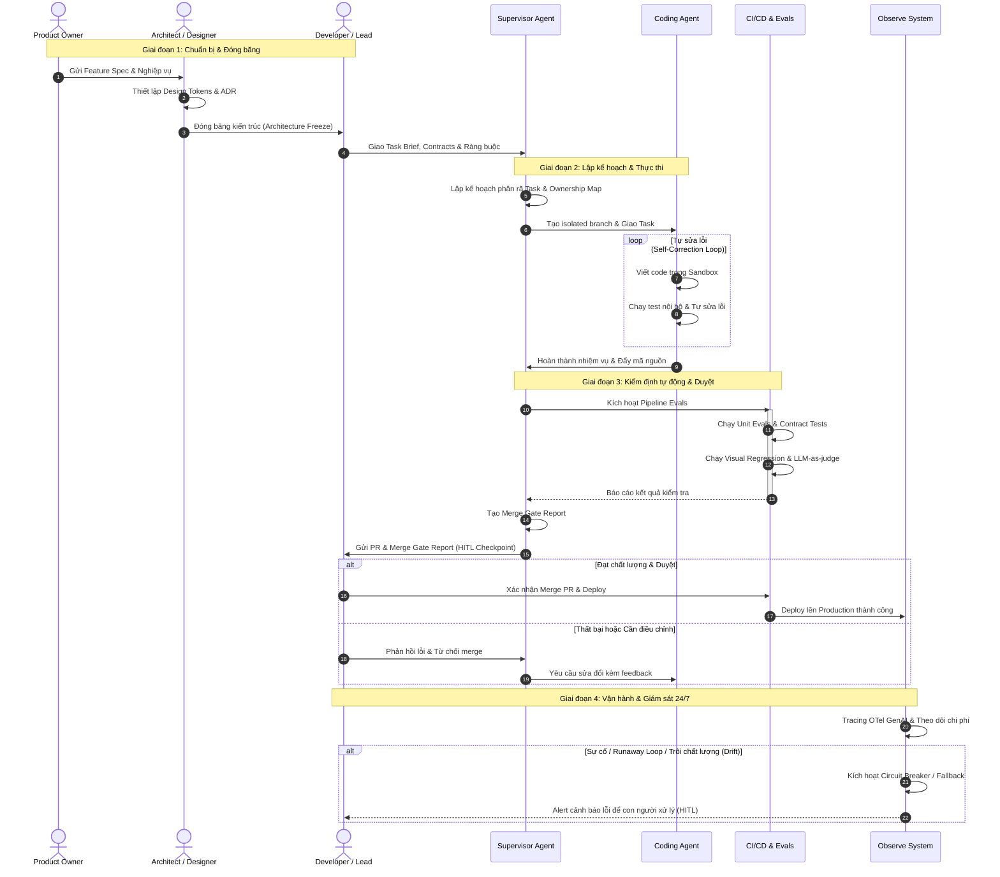
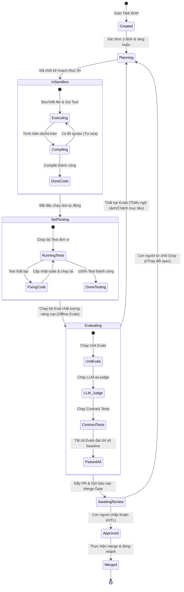
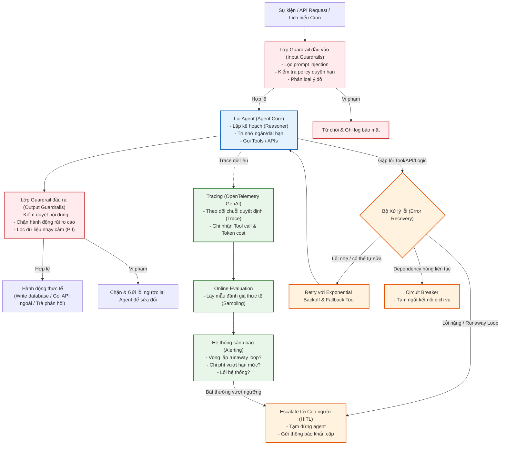
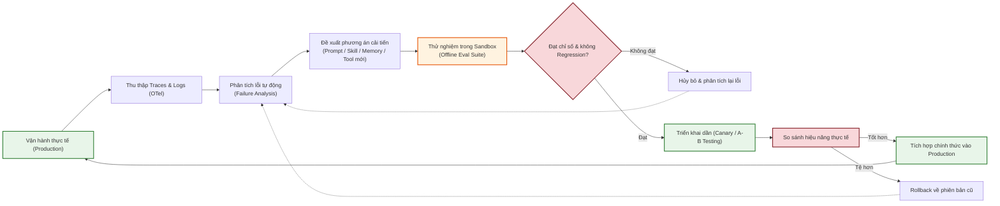
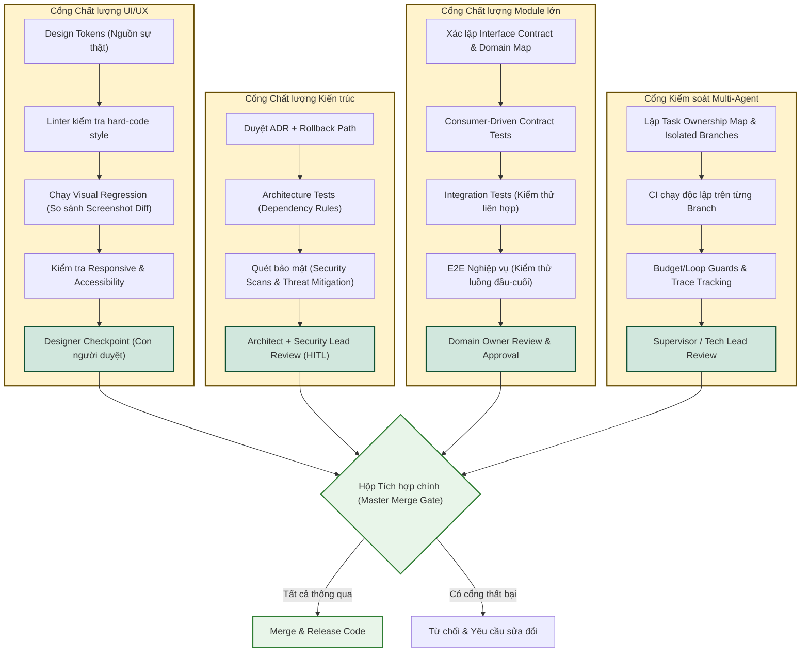
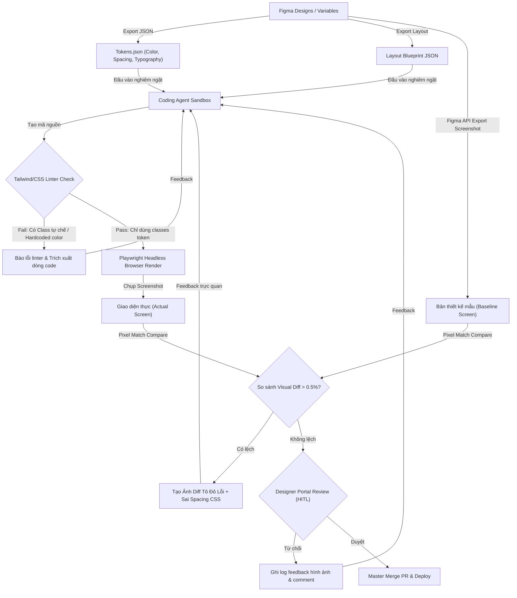
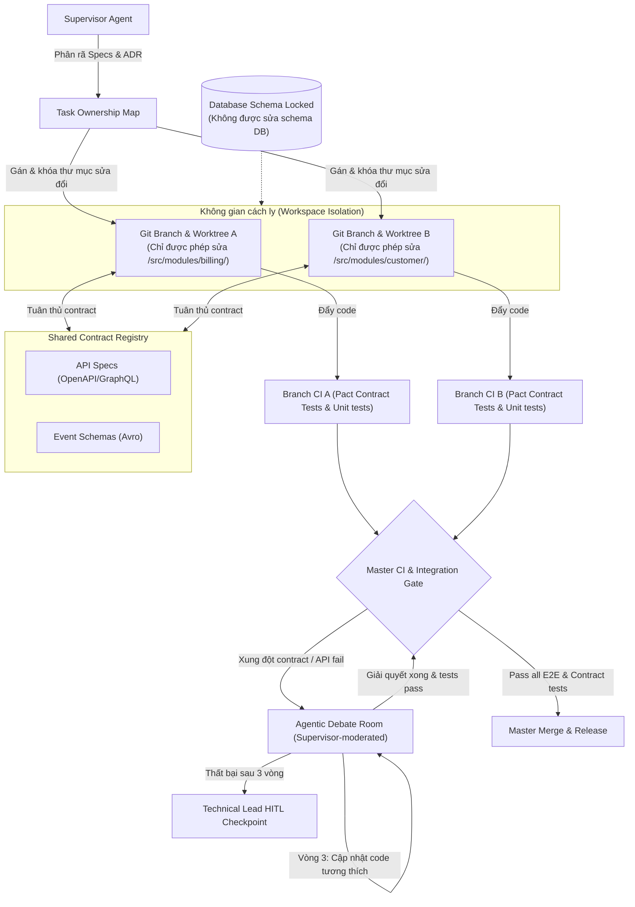

# Bản đồ Quy trình & Luồng Vận hành Agentic SDLC (Master Visual Map)

Tài liệu này tổng hợp và trực quan hóa toàn bộ vòng đời phát triển phần mềm bằng AI Agent (Agentic SDLC). Các sơ đồ dưới đây giúp bạn dễ dàng hình dung từ khâu thiết lập ý định, lập kế hoạch, viết code, kiểm thử, duyệt tích hợp (Merge Gate) cho đến giám sát vận hành 24/7 và cơ chế tự động học hỏi, cải tiến liên tục.

---

## 1. Bản đồ Toàn cảnh Quy trình Agentic SDLC (Master Landscape Map)
Sơ đồ dưới đây bao quát 8 pha trong vòng đời phát triển Agentic (ADLC), làm rõ mối quan hệ giữa **các hoạt động**, **các bên chịu trách nhiệm (Vai trò)**, **các Artifact sinh ra** và **cách con người kiểm soát (HITL)**.

```mermaid
flowchart TB
    subgraph Phase1["Pha 1: Đặc tả ý định (Intent & Constraints)"]
        direction TB
        P1_In["Yêu cầu nghiệp vụ (Business Requirement)"] --> P1_Act["Đặc tả mục tiêu, tiêu chí hoàn thành (DoD), ràng buộc & ngân sách"]
        P1_Act --> P1_Art["Artifacts:<br/>- Feature Spec<br/>- UI/Component Contracts<br/>- Module Contracts"]
    end

    subgraph Phase2["Pha 2: Lập kế hoạch (Planning & Phân rã)"]
        direction TB
        P2_In["Artifacts của Pha 1"] --> P2_Act["Phân tách nhiệm vụ thành các task nhỏ, lập sơ đồ sở hữu (Ownership Map) & xác định rủi ro"]
        P2_Act --> P2_Art["Artifacts:<br/>- Agent Task Brief<br/>- ADR (Architecture Decision Record)"]
    end

    subgraph Phase3["Pha 3: Thực thi (Build / Action)"]
        direction TB
        P3_In["Task Brief & Constraints"] --> P3_Act["Thực thi code/thao tác trong nhánh cô lập (Isolated Worktree/Branch)"]
        P3_Act --> P3_Art["Artifacts:<br/>- Mã nguồn (Source Code)<br/>- Tests mới"]
    end

    subgraph Phase4["Pha 4: Kiểm thử & Đánh giá (Validation & Evals)"]
        direction TB
        P4_In["Source Code & Tests"] --> P4_Act["Chạy CI tự động: Unit Evals, LLM-as-judge Regression, Visual Regression, Contract Tests"]
        P4_Act --> P4_Art["Artifacts:<br/>- Báo cáo kết quả Evals & Tests"]
    end

    subgraph Phase5["Pha 5: Review & Duyệt (Human Checkpoint - HITL)"]
        direction TB
        P5_In["Báo cáo Evals"] --> P5_Act["Con người duyệt tại checkpoint đối với các hành động rủi ro trung bình/cao"]
        P5_Act --> P5_Art["Artifacts:<br/>- Merge Gate Report"]
    end

    subgraph Phase6["Pha 6: Triển khai (Deploy / Ship)"]
        direction TB
        P6_In["Merge Gate Approved"] --> P6_Act["Tích hợp mã nguồn vào nhánh chính & deploy thông qua cổng chất lượng tự động"]
        P6_Act --> P6_Art["Artifacts:<br/>- Release Note<br/>- Production Deployment"]
    end

    subgraph Phase7["Pha 7: Vận hành & Quan sát (Operate 24/7)"]
        direction TB
        P7_In["Production Deployment"] --> P7_Act["Vận hành 24/7, giám sát traces OpenTelemetry, metrics chi phí & độ tin cậy"]
        P7_Act --> P7_Art["Artifacts:<br/>- Telemetry Traces<br/>- Dashboards & Alerts"]
    end

    subgraph Phase8["Pha 8: Học & Tự cải thiện (Learn & Self-Improvement)"]
        direction TB
        P8_In["Telemetry Traces & Logs"] --> P8_Act["Phân tích lỗi tự động, đề xuất nâng cấp Prompt/Skill, thử nghiệm sandbox"]
        P8_Act --> P8_Art["Artifacts:<br/>- Prompt/Skill cập nhật<br/>- Memory bổ sung"]
    end

    %% Kết nối giữa các Pha
    Phase1 --> Phase2
    Phase2 --> Phase3
    Phase3 --> Phase4
    Phase4 --> Phase5
    Phase5 -->|Duyệt| Phase6
    Phase5 -->|Từ chối / Yêu cầu sửa| Phase2
    Phase6 --> Phase7
    Phase7 --> Phase8
    Phase8 -.->|"Cập nhật ý định/ràng buộc (Vòng lặp học hỏi)"| Phase1
    Phase7 -.->|"Sự cố hoặc Drift"| Phase4

    %% Styling
    classDef human fill:#d1e7dd,stroke:#0f5132,stroke-width:2px;
    classDef agent fill:#cff4fc,stroke:#087990,stroke-width:2px;
    classDef gate fill:#fff3cd,stroke:#664d03,stroke-width:2px;
    classDef learn fill:#f8d7da,stroke:#842029,stroke-width:2px;

    class Phase1,Phase5 human;
    class Phase2,Phase3 agent;
    class Phase4,Phase6 gate;
    class Phase7,Phase8 learn;
```



---

## 2. Sơ đồ Trình tự Phát triển Tính năng (Feature Development Sequence Diagram)
Sơ đồ trình tự thời gian thể hiện sự phối hợp chặt chẽ giữa các vai trò Con người, AI Supervisor, AI Coding Agents, hệ thống kiểm thử CI/CD và giám sát vận hành:



---

## 3. Sơ đồ Trạng thái Nhiệm vụ của Agent (Agent Task Lifecycle State Diagram)
Theo dõi trạng thái của một nhiệm vụ dưới sự thực thi của AI Agent, bao gồm cả vòng lặp tự sửa lỗi (Self-Correction) và kiểm thử chất lượng:



---

## 4. Sơ đồ Kiến trúc Vận hành 24/7 & Xử lý lỗi (24/7 Operation & Error Recovery Architecture)
Mô tả cơ chế chạy liên tục của Agent trong môi trường Production cùng với các lớp phòng vệ (Guardrails) và khả năng tự đứng dậy (Error Recovery):



---

## 5. Sơ đồ Vòng lặp Tự cải thiện liên tục (Continuous Self-Improvement Loop)
Mô phỏng cách hệ thống tự học từ các dữ liệu vận hành thực tế mà vẫn đảm bảo tính an toàn cao (không gây lỗi regression):



---

## 6. Bản đồ Cổng Kiểm soát Chất lượng Doanh nghiệp (Enterprise Quality Control Gates Map)
Trực quan hóa ma trận kiểm soát chất lượng (Quality Control Matrix), đảm bảo các đầu ra kỹ thuật luôn tuân thủ các chuẩn chung trước khi tích hợp vào nhánh chính:



---

## 7. Quy trình Figma-to-Code & Vòng lặp Visual QA tự động
Trực quan hóa luồng đồng bộ biến thiết kế (Figma variables) thành mã nguồn dưới sự giám sát nghiêm ngặt của Linter và bộ test so sánh Visual Regression:



---

## 8. Kiến trúc Điều phối Multi-Agent song song hướng Domain (DDMA)
Mô hình chạy song song các Agent lập trình mà vẫn bảo vệ tính toàn vẹn của logic, ranh giới domain và tự động giải quyết các xung đột tích hợp:


```

---

> **Nguyên tắc cốt lõi của bản đồ:**
> 1. **Con người nắm giữ ý định & cấu trúc:** Con người chịu trách nhiệm duyệt Spec, Kiến trúc (ADR), chuẩn giao diện (UI system) và hợp đồng module (Contracts).
> 2. **AI Agent thực thi trong ràng buộc:** Agent tự hoạt động, viết code, sửa lỗi và thực hiện quy trình tự động trong phạm vi các hộp chất lượng và sandbox được thiết lập sẵn.
> 3. **Vòng lặp đóng khép kín:** Mọi hành vi sai lệch trong vận hành (drift) hoặc sự cố sản phẩm đều là đầu vào để cải tiến hệ thống eval và huấn luyện/cải tiến kỹ năng của Agent một cách tự động.
