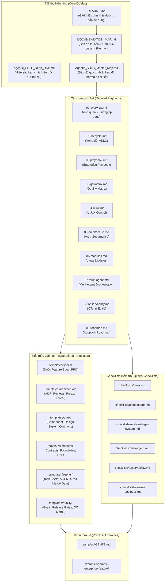

# Bản đồ Hệ thống Tài liệu & Cấu trúc Dự án (Agentic SDLC Documentation Map)

Chào mừng bạn đến với **Bản đồ Hệ thống Tài liệu và Cấu trúc Dự án** của hệ điều hành Agentic SDLC (Agentic SDLC Operating System). Tài liệu này được tạo ra để giúp bạn có một cái nhìn toàn cảnh, rõ ràng và mạch lạc nhất về toàn bộ cấu trúc thư mục, các file tài liệu hướng dẫn (playbooks), các checklists kiểm soát chất lượng, và các biểu mẫu (templates) vận hành thực tế trong dự án này.

---

## 1. Sơ đồ Quan hệ Hệ thống Tài liệu

Sơ đồ dưới đây trực quan hóa cách các tài liệu, mẫu biểu và checklists kết nối với nhau, từ tổng quan nền tảng đến thực thi chi tiết:



---

## 2. Cấu trúc Thư mục Toàn diện (Directory Tree Layout)

Dưới đây là sơ đồ cây thư mục chi tiết của dự án, mô tả vai trò của từng file để bạn dễ dàng tra cứu:

```text
📂 Agentic SDLC (Root Directory)
├── 📄 README.md                        <- Hướng dẫn nhanh sử dụng repo, giới thiệu các playbook & template
├── 📄 Agentic_SDLC_Deep_Dive.md        <- Tài liệu nền tảng đi sâu vào 4 trụ cột, lý thuyết & chi tiết kỹ thuật
├── 📄 Agentic_SDLC_Master_Map.md       <- Master Visual Map chứa 8 sơ đồ Mermaid chi tiết toàn bộ quy trình
├── 📄 DOCUMENTATION_MAP.md             <- Bản đồ hệ thống tài liệu và cấu trúc dự án (Tài liệu này)
├── 📄 generate_portal.py               <- Script Python tự động biên dịch toàn bộ Markdown thành Portal HTML
├── 📄 index.html                       <- Portal HTML Apple-style, hỗ trợ tìm kiếm và đọc tài liệu tập trung
│
├── 📂 docs                             <- Thư mục chứa các cẩm nang (Playbooks) vận hành chi tiết
│   ├── 📄 00-overview.md               <- Giới thiệu tổng quan hệ điều hành và luồng áp dụng chuẩn
│   ├── 📄 01-agentic-sdlc-lifecycle.md  <- Chi tiết 8 pha của Vòng đời Phát triển Agentic (ADLC)
│   ├── 📄 02-enterprise-delivery-playbook.md <- Nguyên tắc điều hành, phân vai Human-Agent và phân loại rủi ro
│   ├── 📄 03-quality-control-matrix.md <- Ma trận kiểm soát chất lượng (QC Matrix): Nguồn sự thật & Guardrails
│   ├── 📄 04-ui-ux-control-system.md   <- Quy trình đồng bộ Figma-to-Code & QA hình ảnh tự động
│   ├── 📄 05-architecture-governance.md <- Cơ chế Architecture Freeze & Review đa vai trước khi Agent code
│   ├── 📄 06-large-module-delivery.md  <- Hợp đồng Module (Module Contracts) và thiết lập AGENTS.md phân tầng
│   ├── 📄 07-multi-agent-orchestration.md <- Kỹ thuật điều phối multi-agent song song hướng Domain (DDMA)
│   ├── 📄 08-observability-evals-governance.md <- Tracing OpenTelemetry, Evals và an toàn theo OWASP Agentic
│   └── 📄 09-adoption-roadmap.md       <- Lộ trình 5 bước áp dụng và thang đo mức độ trưởng thành (Maturity)
│
├── 📂 checklists                       <- Thư mục chứa các checklist kiểm duyệt chất lượng độc lập
│   ├── 📄 ui-ux.md                     <- Checklist kiểm tra giao diện, responsive, a11y và visual regression
│   ├── 📄 architecture.md              <- Checklist chốt kiến trúc trước build và duyệt bảo mật/threat model
│   ├── 📄 module-large-system.md       <- Checklist chia tách domain boundary và xác nhận interface contracts
│   ├── 📄 multi-agent.md               <- Checklist điều phối nhánh, budget guard và tích hợp multi-agent
│   ├── 📄 observability.md             <- Checklist cài đặt tracing OTel, online/offline evals và lập cảnh báo
│   └── 📄 release-readiness.md         <- Checklist cổng chất lượng cuối cùng trước khi deploy sản phẩm
│
├── 📂 templates                        <- Thư mục chứa các biểu mẫu (templates) để áp dụng vào dự án
│   ├── 📂 specs                        <- Templates đặc tả ý đồ nghiệp vụ ban đầu
│   │   ├── 📄 product-requirement.md   <- Yêu cầu sản phẩm (PRD) cho con người viết
│   │   ├── 📄 feature-spec.md          <- Đặc tả tính năng máy đọc được để cấp cho Agent
│   │   └── 📄 definition-of-done.md    <- Tiêu chí hoàn thành (DoD) rõ ràng cho từng task
│   │
│   ├── 📂 architecture                 <- Templates phục vụ việc khóa kiến trúc nền tảng
│   │   ├── 📄 adr.md                   <- Bản ghi Quyết định Kiến trúc (Architecture Decision Record)
│   │   ├── 📄 threat-model.md          <- Phân tích rủi ro bảo mật & biện pháp giảm thiểu cho Agent
│   │   ├── 📄 architecture-review.md   <- Biên bản đánh giá kiến trúc đa vai (Architect, Security, v.v.)
│   │   └── 📄 architecture-freeze-checklist.md <- Checklist khóa kiến trúc trước khi giao việc cho Agent
│   │
│   ├── 📂 ui-ux                        <- Templates kiểm soát tính đồng nhất về mặt thị giác
│   │   ├── 📄 design-system-contract.md <- Hợp đồng design tokens & component library được phép dùng
│   │   ├── 📄 component-contract.md    <- Hợp đồng giao tiếp kỹ thuật của component UI cụ thể
│   │   ├── 📄 ui-review-checklist.md   <- Checklist cho Designer duyệt thủ công trên cổng HITL
│   │   └── 📄 visual-regression-checklist.md <- Tiêu chuẩn chạy Visual QA & so sánh Screenshot Diff tự động
│   │
│   ├── 📂 modules                      <- Templates phân rã nghiệp vụ hệ thống lớn
│   │   ├── 📄 domain-boundary.md       <- Định nghĩa ranh giới và trách nhiệm của Domain Bounded Context
│   │   ├── 📄 module-contract.md       <- Hợp đồng interface, data ownership và mô hình lỗi của module
│   │   ├── 📄 data-ownership.md        <- Bản đồ phân định quyền đọc/ghi dữ liệu của các module
│   │   └── 📄 e2e-business-flow.md     <- Đặc tả luồng nghiệp vụ liên hợp đầu-cuối xuyên module
│   │
│   ├── 📂 agents                       <- Templates thiết lập môi trường & điều phối Agent
│   │   ├── 📄 root-AGENTS.md           <- File hướng dẫn & quy chuẩn code toàn cục đặt tại thư mục root
│   │   ├── 📄 module-AGENTS.md         <- File hướng dẫn & ngữ cảnh nghiệp vụ cục bộ tại từng module
│   │   ├── 📄 agent-task-brief.md      <- Phiếu giao việc (Task Brief) kèm ràng buộc chi tiết cho một Agent
│   │   ├── 📄 multi-agent-ownership-map.md <- Sơ đồ phân chia nhánh và thư mục được phép sửa của từng Agent
│   │   └── 📄 merge-gate-report.md     <- Báo cáo kết quả Evals & chất lượng trước khi merge PR (HITL checkpoint)
│   │
│   └── 📂 quality                      <- Templates đánh giá chất lượng và kiểm soát rủi ro vận hành
│       ├── 📄 quality-control-matrix.md <- Ma trận kết nối rủi ro thực tế với guardrail tự động & checkpoint
│       ├── 📄 eval-plan.md             <- Kế hoạch đánh giá 3 lớp (Unit Evals, LLM-as-judge, Production Sampling)
│       ├── 📄 release-gate.md          <- Tiêu chí chốt chất lượng tự động chặn release khi regression
│       └── 📄 production-readiness-checklist.md <- Checklist cổng chất lượng cuối cùng trước khi đưa lên chạy 24/7
│
└── 📂 examples                         <- Thư mục chứa các ví dụ thực tế hoàn chỉnh
    ├── 📄 sample-AGENTS.md             <- Ví dụ cụ thể về nội dung file chỉ dẫn Agent trong dự án thật
    └── 📂 sample-enterprise-feature   <- Ví dụ một tính năng doanh nghiệp đi từ đặc tả đến merge gate
        ├── 📄 feature-spec.md          <- Feature Spec thực tế mẫu
        ├── 📄 adr.md                   <- ADR thực tế mẫu khóa thiết kế lưu trữ
        ├── 📄 ui-component-contract.md <- Hợp đồng component thực tế mẫu cho màn hình thanh toán
        ├── 📄 module-contract.md       <- Hợp đồng interface thực tế mẫu giữa Billing & Customer modules
        ├── 📄 agent-task-brief.md      <- Task Brief thực tế mẫu giao cho Code Agent thực hiện
        └── 📄 merge-gate-report.md     <- Merge Gate Report thực tế mẫu gửi cho Tech Lead duyệt tích hợp
```

---

## 3. Mapping Tài liệu theo 8 Pha của Vòng đời Agentic SDLC

Hệ điều hành Agentic SDLC được vận hành dựa trên 8 pha khép kín. Bảng dưới đây ánh xạ chính xác mỗi pha với các Playbooks hướng dẫn, Checklists kiểm duyệt, Biểu mẫu áp dụng và Ví dụ thực tế:

| Pha vận hành | 📖 Playbooks (docs/) | 📋 Checklists | 📝 Templates | 🛠️ Ví dụ thực tế (examples/) |
|---|---|---|---|---|
| **Pha 1: Đặc tả ý định** *(Intent & DoD)* | [01-Lifecycle](file:///Users/tuananh/Library/Mobile%20Documents/com~apple~CloudDocs/CODEX/Agentic%20SDLC/docs/01-agentic-sdlc-lifecycle.md)<br/>[04-UI/UX Control](file:///Users/tuananh/Library/Mobile%20Documents/com~apple~CloudDocs/CODEX/Agentic%20SDLC/docs/04-ui-ux-control-system.md) | [ui-ux.md](file:///Users/tuananh/Library/Mobile%20Documents/com~apple~CloudDocs/CODEX/Agentic%20SDLC/checklists/ui-ux.md) | `specs/product-requirement.md`<br/>`specs/feature-spec.md`<br/>`specs/definition-of-done.md`<br/>`ui-ux/design-system-contract.md`<br/>`ui-ux/component-contract.md` | `sample-enterprise-feature/feature-spec.md`<br/>`sample-enterprise-feature/ui-component-contract.md` |
| **Pha 2: Lập kế hoạch & Phân rã** *(Planning)* | [05-Architecture](file:///Users/tuananh/Library/Mobile%20Documents/com~apple~CloudDocs/CODEX/Agentic%20SDLC/docs/05-architecture-governance.md)<br/>[06-Large Modules](file:///Users/tuananh/Library/Mobile%20Documents/com~apple~CloudDocs/CODEX/Agentic%20SDLC/docs/06-large-module-delivery.md)<br/>[07-Multi-Agent](file:///Users/tuananh/Library/Mobile%20Documents/com~apple~CloudDocs/CODEX/Agentic%20SDLC/docs/07-multi-agent-orchestration.md) | [architecture.md](file:///Users/tuananh/Library/Mobile%20Documents/com~apple~CloudDocs/CODEX/Agentic%20SDLC/checklists/architecture.md)<br/>[module-large-system.md](file:///Users/tuananh/Library/Mobile%20Documents/com~apple~CloudDocs/CODEX/Agentic%20SDLC/checklists/module-large-system.md)<br/>[multi-agent.md](file:///Users/tuananh/Library/Mobile%20Documents/com~apple~CloudDocs/CODEX/Agentic%20SDLC/checklists/multi-agent.md) | `architecture/adr.md`<br/>`architecture/threat-model.md`<br/>`architecture/architecture-freeze-checklist.md`<br/>`modules/domain-boundary.md`<br/>`modules/module-contract.md`<br/>`modules/data-ownership.md`<br/>`agents/agent-task-brief.md`<br/>`agents/multi-agent-ownership-map.md`<br/>`agents/root-AGENTS.md`<br/>`agents/module-AGENTS.md` | `sample-enterprise-feature/adr.md`<br/>`sample-enterprise-feature/module-contract.md`<br/>`sample-enterprise-feature/agent-task-brief.md`<br/>`sample-AGENTS.md` |
| **Pha 3: Thực thi** *(Build / Actions)* | [07-Multi-Agent](file:///Users/tuananh/Library/Mobile%20Documents/com~apple~CloudDocs/CODEX/Agentic%20SDLC/docs/07-multi-agent-orchestration.md) | *Tự trị hoàn toàn trong sandbox riêng* | `agents/agent-task-brief.md`<br/>`agents/root-AGENTS.md`<br/>`agents/module-AGENTS.md` | `sample-enterprise-feature/agent-task-brief.md`<br/>`sample-AGENTS.md` |
| **Pha 4: Kiểm thử & Đánh giá** *(Evals)* | [03-QC Matrix](file:///Users/tuananh/Library/Mobile%20Documents/com~apple~CloudDocs/CODEX/Agentic%20SDLC/docs/03-quality-control-matrix.md)<br/>[08-Observability](file:///Users/tuananh/Library/Mobile%20Documents/com~apple~CloudDocs/CODEX/Agentic%20SDLC/docs/08-observability-evals-governance.md) | [observability.md](file:///Users/tuananh/Library/Mobile%20Documents/com~apple~CloudDocs/CODEX/Agentic%20SDLC/checklists/observability.md) | `quality/quality-control-matrix.md`<br/>`quality/eval-plan.md`<br/>`ui-ux/visual-regression-checklist.md` | *Được cấu hình tự động trong hệ thống CI/CD* |
| **Pha 5: Review & Duyệt (HITL)** *(Gates)* | [02-Enterprise Playbook](file:///Users/tuananh/Library/Mobile%20Documents/com~apple~CloudDocs/CODEX/Agentic%20SDLC/docs/02-enterprise-delivery-playbook.md) | [ui-ux.md](file:///Users/tuananh/Library/Mobile%20Documents/com~apple~CloudDocs/CODEX/Agentic%20SDLC/checklists/ui-ux.md)<br/>[architecture.md](file:///Users/tuananh/Library/Mobile%20Documents/com~apple~CloudDocs/CODEX/Agentic%20SDLC/checklists/architecture.md) | `agents/merge-gate-report.md`<br/>`architecture/architecture-review.md`<br/>`ui-ux/ui-review-checklist.md` | `sample-enterprise-feature/merge-gate-report.md` |
| **Pha 6: Triển khai** *(Deploy / Ship)* | [02-Enterprise Playbook](file:///Users/tuananh/Library/Mobile%20Documents/com~apple~CloudDocs/CODEX/Agentic%20SDLC/docs/02-enterprise-delivery-playbook.md) | [release-readiness.md](file:///Users/tuananh/Library/Mobile%20Documents/com~apple~CloudDocs/CODEX/Agentic%20SDLC/checklists/release-readiness.md) | `quality/release-gate.md`<br/>`quality/production-readiness-checklist.md` | *Được kích hoạt sau khi Merge Gate được phê duyệt* |
| **Pha 7: Vận hành & Giám sát** *(Operate)* | [08-Observability](file:///Users/tuananh/Library/Mobile%20Documents/com~apple~CloudDocs/CODEX/Agentic%20SDLC/docs/08-observability-evals-governance.md) | [observability.md](file:///Users/tuananh/Library/Mobile%20Documents/com~apple~CloudDocs/CODEX/Agentic%20SDLC/checklists/observability.md) | `quality/eval-plan.md` | *Giám sát trace & chi phí tự động trên production* |
| **Pha 8: Học & Tự cải thiện** *(Learn)* | [09-Roadmap](file:///Users/tuananh/Library/Mobile%20Documents/com~apple~CloudDocs/CODEX/Agentic%20SDLC/docs/09-adoption-roadmap.md) | *Vòng lặp tự động hóa khép kín* | *Cải tiến Prompt/Skill & Cập nhật Memory trong Sandbox* | *Phát hiện lỗi thực tế -> Trở thành test case offline* |

---

## 4. Ma trận Lựa chọn Tài liệu Theo Nhu cầu Sử dụng

Khi gặp một vấn đề hoặc nhu cầu thực tế trong dự án, bạn nên sử dụng tài liệu nào? Hãy tham khảo bảng hướng dẫn nhanh dưới đây:

| Bạn cần giải quyết vấn đề gì? | 📖 Playbook nên đọc | 📋 Checklist nên dùng | 📝 Template nên copy |
|---|---|---|---|
| **Bắt đầu một tính năng mới** cần làm rõ phạm vi nghiệp vụ và ràng buộc kỹ thuật. | [01-Lifecycle](file:///Users/tuananh/Library/Mobile%20Documents/com~apple~CloudDocs/CODEX/Agentic%20SDLC/docs/01-agentic-sdlc-lifecycle.md) | - | `specs/feature-spec.md`<br/>`specs/definition-of-done.md` |
| **Chốt thiết kế kiến trúc** khó đảo ngược, lựa chọn cơ sở dữ liệu, hoặc đánh giá an ninh. | [05-Architecture](file:///Users/tuananh/Library/Mobile%20Documents/com~apple~CloudDocs/CODEX/Agentic%20SDLC/docs/05-architecture-governance.md) | [architecture.md](file:///Users/tuananh/Library/Mobile%20Documents/com~apple~CloudDocs/CODEX/Agentic%20SDLC/checklists/architecture.md) | `architecture/adr.md`<br/>`architecture/threat-model.md`<br/>`architecture/architecture-freeze-checklist.md` |
| **Làm việc với giao diện UI/UX** phức tạp, cần giữ độ đồng nhất tuyệt đối về spacing, màu sắc và typography. | [04-UI/UX Control](file:///Users/tuananh/Library/Mobile%20Documents/com~apple~CloudDocs/CODEX/Agentic%20SDLC/docs/04-ui-ux-control-system.md) | [ui-ux.md](file:///Users/tuananh/Library/Mobile%20Documents/com~apple~CloudDocs/CODEX/Agentic%20SDLC/checklists/ui-ux.md) | `ui-ux/design-system-contract.md`<br/>`ui-ux/component-contract.md`<br/>`ui-ux/ui-review-checklist.md` |
| **Chia nhỏ một module nghiệp vụ lớn** để tránh mất logic hoặc nhập nhằng về quyền sở hữu dữ liệu. | [06-Large Modules](file:///Users/tuananh/Library/Mobile%20Documents/com~apple~CloudDocs/CODEX/Agentic%20SDLC/docs/06-large-module-delivery.md) | [module-large-system.md](file:///Users/tuananh/Library/Mobile%20Documents/com~apple~CloudDocs/CODEX/Agentic%20SDLC/checklists/module-large-system.md) | `modules/domain-boundary.md`<br/>`modules/module-contract.md`<br/>`modules/data-ownership.md` |
| **Chạy song song nhiều coding agents** trên cùng một repo mà không lo bị xung đột nhánh code hoặc cháy ngân sách. | [07-Multi-Agent](file:///Users/tuananh/Library/Mobile%20Documents/com~apple~CloudDocs/CODEX/Agentic%20SDLC/docs/07-multi-agent-orchestration.md) | [multi-agent.md](file:///Users/tuananh/Library/Mobile%20Documents/com~apple~CloudDocs/CODEX/Agentic%20SDLC/checklists/multi-agent.md) | `agents/agent-task-brief.md`<br/>`agents/multi-agent-ownership-map.md`<br/>`agents/root-AGENTS.md` |
| **Thiết lập hệ thống kiểm soát chất lượng**, viết bộ eval, cài tracing OpenTelemetry và xử lý lỗi vận hành 24/7. | [08-Observability](file:///Users/tuananh/Library/Mobile%20Documents/com~apple~CloudDocs/CODEX/Agentic%20SDLC/docs/08-observability-evals-governance.md) | [observability.md](file:///Users/tuananh/Library/Mobile%20Documents/com~apple~CloudDocs/CODEX/Agentic%20SDLC/checklists/observability.md) | `quality/quality-control-matrix.md`<br/>`quality/eval-plan.md` |
| **Chuẩn bị tích hợp code và release** tính năng lên môi trường Production an toàn tuyệt đối. | [02-Enterprise Playbook](file:///Users/tuananh/Library/Mobile%20Documents/com~apple~CloudDocs/CODEX/Agentic%20SDLC/docs/02-enterprise-delivery-playbook.md) | [release-readiness.md](file:///Users/tuananh/Library/Mobile%20Documents/com~apple~CloudDocs/CODEX/Agentic%20SDLC/checklists/release-readiness.md) | `agents/merge-gate-report.md`<br/>`quality/release-gate.md`<br/>`quality/production-readiness-checklist.md` |
| **Lên lộ trình chuyển dịch tổ chức** sang mô hình phát triển phần mềm bằng AI Agent (Agentic SDLC). | [09-Roadmap](file:///Users/tuananh/Library/Mobile%20Documents/com~apple~CloudDocs/CODEX/Agentic%20SDLC/docs/09-adoption-roadmap.md) | - | - |

---

## 5. Hướng dẫn Tích hợp & Vận hành Tài liệu trong dự án thực tế

Để biến hệ thống tài liệu này thành các quy chuẩn thực thi tự động (Executable Rules) trong dự án của bạn, hãy thực hiện theo 3 bước sau:

1. **Bước 1: Thiết lập AGENTS.md**
   - Copy file `templates/agents/root-AGENTS.md` đặt ở thư mục root của dự án thực tế của bạn.
   - Tại các module chuyên biệt, copy file `templates/agents/module-AGENTS.md` để cung cấp bối cảnh nghiệp vụ cục bộ cho AI Agent.
2. **Bước 2: Cài đặt các Checklists tự động hóa**
   - Ánh xạ các checklists từ thư mục `checklists/` thành các công cụ linter tĩnh, test case và pipeline CI/CD kiểm duyệt tự động để kiểm soát lỗi trước khi merge.
3. **Bước 3: Vận hành biểu mẫu (Templates)**
   - Mỗi khi bắt đầu một chu kỳ tính năng mới, hãy tạo một thư mục tính năng (tương tự như cấu trúc mẫu trong `examples/sample-enterprise-feature/`) và điền đầy đủ các mẫu `feature-spec.md`, `adr.md`, và `module-contract.md` để làm nguồn sự thật (Single Source of Truth) dẫn đường cho AI Agent code chính xác.
