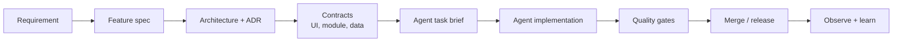

# Overview

Bộ repo này là một "operating system" cho Agentic SDLC: không chỉ nói về AI agent, mà cung cấp tài liệu, template và checklist để điều hành AI agent trong dự án phần mềm thật.

> [!TIP]
> Bạn có thể bắt đầu bằng việc xem [Bản đồ Hệ thống Tài liệu](../DOCUMENTATION_MAP.md) để hiểu rõ cấu trúc thư mục, hoặc xem bản đồ trực quan toàn cảnh với các sơ đồ Mermaid chi tiết tại [Bản đồ Quy trình trực quan (Master Visual Map)](../Agentic_SDLC_Master_Map.md) trước khi đi sâu vào từng tài liệu cụ thể dưới đây.

## Mục tiêu

- Giữ UI/UX đồng nhất bằng design system, component contract và visual regression.
- Khóa kiến trúc bằng spec, ADR, architecture review và freeze checklist trước khi agent build.
- Chia module lớn theo domain boundary và interface contract để không mất logic nghiệp vụ.
- Chạy multi-agent song song bằng supervisor, isolated worktree, ownership map và merge gate.
- Đưa observability, eval, governance và HITL vào quy trình giao hàng.

## Luồng áp dụng chuẩn

## Vai trò

| Vai trò | Sở hữu |
|---|---|
| Product owner | Intent, business outcome, acceptance criteria |
| Architect | Architecture, ADR, module boundary, rollback path |
| Designer lead | Design system, UX rule, component approval |
| Domain owner | Business rules, workflow, data meaning |
| Agent supervisor | Task split, agent scope, merge coordination |
| AI agent | Implementation inside approved constraints |

## Nguồn tham chiếu

Xem chi tiết danh mục tài liệu tại [Bản đồ Hệ thống Tài liệu](../DOCUMENTATION_MAP.md). Đọc `Agentic_SDLC_Deep_Dive.md` khi cần hiểu sâu nền tảng lý thuyết, rủi ro, reasoning và bối cảnh. Dùng thư mục `docs/`, `templates/`, `checklists/` khi triển khai thực tế.

