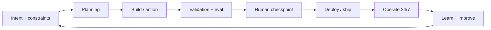

# Agentic SDLC Lifecycle

Agentic SDLC là vòng đời phát triển trong đó AI agent tham gia xuyên suốt từ đặc tả, lập kế hoạch, thực thi, kiểm thử, review, deploy đến vận hành.

> [!TIP]
> Bạn có thể xem bản đồ trực quan đầy đủ của vòng đời này (gồm Sơ đồ Master, Sơ đồ Trình tự tương tác và Sơ đồ Trạng thái nhiệm vụ của Agent) tại [Bản đồ Quy trình trực quan (Master Visual Map)](../Agentic_SDLC_Master_Map.md).

## Vòng đời chuẩn

## Cổng kiểm soát

- Intent phải có success criteria, out-of-scope, risk level và budget.
- Planning phải tạo task nhỏ, dependency, test expectation và owner.
- Build chỉ được chạy trong constraint đã duyệt.
- Validation gồm test tất định, eval chất lượng, security và regression.
- Human checkpoint áp dụng cho quyết định khó đảo hoặc tác động cao.
- Operate cần trace, metrics, alert, sampling và failure analysis.

## Artifact cần có

- Feature spec.
- Definition of Done.
- ADR nếu có quyết định kiến trúc.
- UI/component contract nếu có UI.
- Module contract nếu chạm biên module.
- Agent task brief nếu giao cho AI agent.
- Merge gate report trước khi merge.

