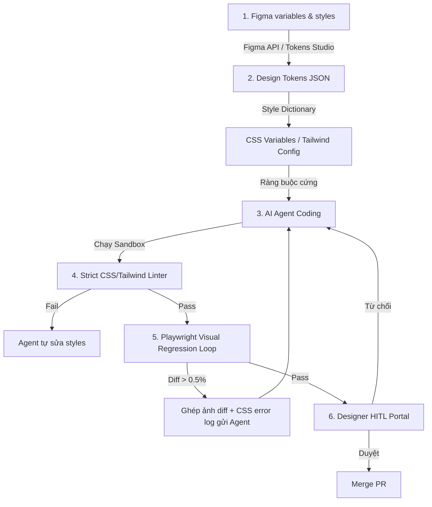

# Playbook: Kiểm soát Giao diện & Quy trình Đồng bộ Figma-to-Code

Tài liệu này hướng dẫn cách chuyển đổi các nguyên tắc UI/UX từ thẩm mỹ chủ quan trên Figma thành các cổng kiểm soát kỹ thuật tất định, đảm bảo AI Agent tạo ra giao diện chính xác và đồng nhất 100% với thiết kế.

---

## 1. Bản chất: Vì sao AI Agent cần Cổng Kiểm soát UI?
AI Agent không có mắt vật lý để cảm nhận tính thẩm mỹ hay tỷ lệ khoảng cách. Nếu chỉ ra lệnh bằng prompt mô tả chung chung, giao diện sinh ra sẽ bị phân mảnh, sai lệch spacing, và tự chế component. 

Giải pháp là **cưỡng chế tất định (Deterministic Enforcement)**: biến thiết kế Figma thành cấu trúc dữ liệu và thư viện component máy-đọc-được, sau đó dùng linter và kiểm thử visual để ép Agent tuân thủ.

---

## 2. Quy trình 6 bước từ Figma đến Mã nguồn (Figma-to-Code Pipeline)



### Bước 1: Đồng bộ Design Tokens từ Figma
- Mọi giá trị màu sắc, typography, spacing (margin/padding), border radius, shadow, và z-index được quản lý tập trung trên Figma Variables.
- Sử dụng các plugin như **Token Studio for Figma** hoặc Figma API để tự động export các biến này thành tệp tin cấu hình thiết kế máy đọc được (`tokens.json`).

### Bước 2: Biên dịch cấu trúc biến thiết kế (Compilation)
- Tệp `tokens.json` được Style Dictionary biên dịch tự động thành cấu hình hệ thống:
  - Biến CSS (`:root { --color-primary: #1565c0; }`).
  - Tailwind Config (`theme: { extend: { spacing: { 'token-md': '16px' } } }`).

### Bước 3: Lập trình dưới ràng buộc của Thư viện Component (Component Allowlist)
- Cung cấp cho Agent tài liệu đặc tả thư viện component nội bộ có sẵn (Button, TextInput, Modal, Table...) kèm props và các biến thể (variants).
- **Quy tắc bất biến:** Agent chỉ được lắp ghép UI từ thư viện đã duyệt. Không được viết inline style mới, không được dùng class CSS thuần tự do.

### Bước 4: Lưới lọc mã nguồn tự động (Linting Gates)
- Cấu hình linter nghiêm ngặt (ví dụ: `eslint-plugin-tailwindcss` hoặc stylelint) chặn hoàn toàn:
  - Các mã màu hex cứng (ví dụ: chặn `text-[#ff5733]`, bắt buộc dùng `text-primary`).
  - Các khoảng cách tùy ý (ví dụ: chặn `mt-[13px]`, bắt buộc dùng `mt-token-md`).
- Nếu linter phát hiện vi phạm, CI/CD lập tức chặn biên dịch và trả lỗi về cho Agent tự chỉnh sửa.

### Bước 5: Vòng lặp Visual QA tự động (Visual Regression Test Loop)
- CI/CD tự động dựng ứng dụng trong môi trường sandbox và dùng **Playwright** hoặc **Puppeteer** để chụp screenshot giao diện thật.
- Giao diện được chụp ở 3 viewports chuẩn: Mobile (375px), Tablet (768px), Desktop (1440px) và qua ma trận 5 trạng thái tương tác (`default`, `hover`, `active`, `focus`, `loading`, `error`, `empty`).
- Tiến hành so sánh điểm ảnh (pixel-by-pixel comparison) với thiết kế mẫu xuất từ Figma.
- **Vòng lặp sửa lỗi của Agent:** 
  - Nếu tỉ lệ lệch ảnh (visual diff) > **0.5%**, hệ thống tự động sinh ảnh ghép tô đỏ vùng lệch, trích xuất mã CSS lỗi và gửi phản hồi lại cho Agent.
  - Agent đọc hình ảnh diff và log để sửa code, chạy lại visual test. Tối đa chạy 3 vòng lặp.

### Bước 6: Cổng kiểm duyệt trực quan của Nhà thiết kế (Designer HITL Portal)
- Sau khi giao diện vượt qua vòng lặp Visual QA tự động, PR được tạo ra kèm báo cáo ảnh diff.
- PR được đẩy lên một cổng duyệt trực quan (Designer HITL Portal), cho phép designer duyệt hoặc từ chối và ghi lại phản hồi bằng hình ảnh/văn bản. Đóng góp ý kiến này sẽ được đưa vào bộ nhớ/task tiếp theo của Agent.

---

## 3. Các cơ chế kiểm soát tất định (Deterministic Controls)

### Cấu hình Linter cưỡng chế (Example `.eslintrc.json`)
```json
{
  "plugins": ["tailwindcss"],
  "rules": {
    "tailwindcss/no-custom-classname": "error",
    "tailwindcss/classnames-order": "warn",
    "tailwindcss/no-arbitrary-value": "error"
  }
}
```
*Rule `no-arbitrary-value: "error"` sẽ chặn đứng mọi class tự chế dạng `h-[123px]` hoặc `p-[9px]`, buộc Agent sử dụng biến thiết kế đã chốt.*

### Ma trận trạng thái giao diện bắt buộc (State Matrix)
Mỗi màn hình được Agent dựng phải có tối thiểu các file test case tương ứng với các trạng thái sau để chụp ảnh đối chiếu:
- `PageName.stories.tsx` (hoặc test script) định nghĩa:
  - `DefaultState` (Dữ liệu chuẩn).
  - `LoadingState` (Đang tải).
  - `EmptyState` (Không có dữ liệu - kiểm tra empty icon & text).
  - `ErrorState` (Lỗi API - kiểm tra nút retry, thông báo lỗi).
  - `InteractedState` (Trạng thái hover/active của các nút bấm).

---

## 4. Tiêu chí Pass/Fail đối với Giao diện

- **PASS:**
  - 100% CSS/Tailwind classes lấy từ Design Tokens của Figma.
  - Vượt qua linter kiểm tra cứng, không chứa giá trị hard-coded.
  - Visual regression diff < 0.5% ở tất cả các kích thước màn hình và trạng thái.
  - Được Designer duyệt và ký nhận (Sign-off) trên HITL Portal.

- **FAIL:**
  - Tự ý viết CSS inline hoặc class Tailwind tự chế (`mt-[17px]`, `#123456`).
  - Lệch phông chữ, cỡ chữ, hoặc thiếu trạng thái Responsive.
  - Thiếu màn hình Loading, Error, hoặc Empty.
  - Visual regression diff >= 0.5% so với Figma mà chưa được Designer ký duyệt đặc cách.
