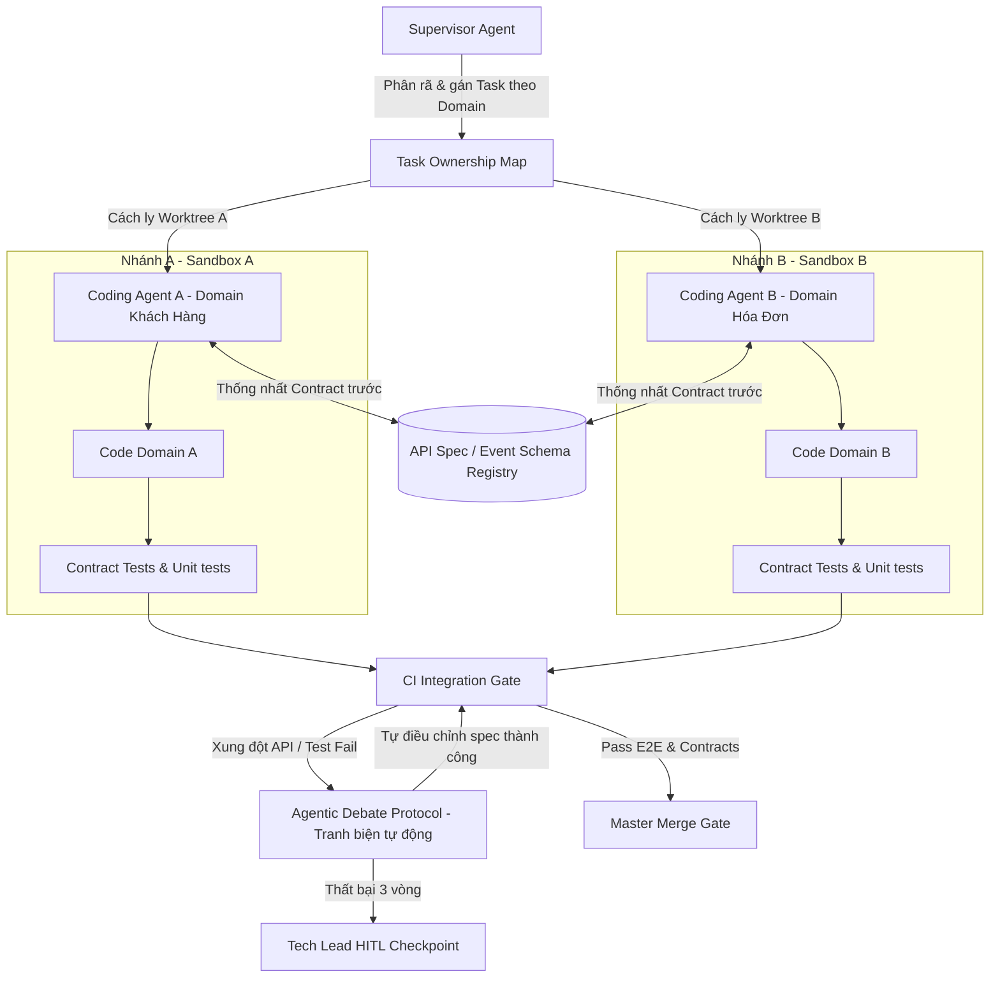

# Playbook: Điều phối Multi-Agent Song song hướng Domain

Tài liệu này hướng dẫn chi tiết mô hình kiến trúc Domain-Driven Multi-Agent (DDMA) để chạy nhiều AI Agent lập trình song song nhằm tăng tốc độ bàn giao dự án lớn, phức tạp, mà vẫn bảo đảm tuyệt đối tính liên kết, đồng bộ và logic nghiệp vụ.

---

## 1. Kiến trúc Tổng thể Domain-Driven Multi-Agent (DDMA)

Trong các hệ thống lớn có nhiều nghiệp vụ đan xen, nếu để nhiều agent cùng tự do sửa đổi mã nguồn sẽ dẫn đến xung đột code (merge conflict), phá vỡ kiến trúc, chồng lấn dữ liệu, và sai lệch logic. 

Giải pháp là **chia để trị dựa trên Domain-Driven Design (DDD)** kết hợp **Hợp đồng giao diện (API/Event Contracts)** và **Vòng tranh biện tự động (Agentic Debate Loop)** dưới sự giám sát của Supervisor Agent.

---

## 2. Ba Trụ cột Kiểm soát Logic và Tính liên kết (Three Pillars of Cohesion)

### Trụ cột 1: Cách ly Không gian làm việc (Workspace Isolation)
Để tránh các agent sửa đè code của nhau, chúng tôi áp dụng:
- **Isolated Git Worktrees:** Mỗi agent hoạt động trên một branch và Git Worktree (thư mục vật lý) độc lập.
- **Directory Access Lock (Cấm biên):** Định nghĩa ranh giới Bounded Context nghiêm ngặt. Hệ thống pre-commit hooks (ví dụ: Husky) chặn cứng không cho phép Agent sửa đổi các file nằm ngoài thư mục domain được phân quyền trong Task Brief.
  - *Ví dụ:* Agent A phụ trách domain *Hóa Đơn* chỉ được phép tạo và sửa đổi các file trong `/src/modules/billing/`. Mọi thay đổi ngoài thư mục này sẽ bị git hook từ chối commit.
- **Database Schema Lock (Khóa cơ sở dữ liệu):** Schema database là bất biến trong suốt quá trình agent lập trình song song. Mọi đề xuất thêm bảng hoặc thay đổi kiểu dữ liệu trường phải được viết thành tệp migration và được Architect (Con người) duyệt trước khi phân phối task cho các agent.

### Trụ cột 2: Contract-First (Hợp đồng trước, Viết code sau)
- Trước khi bắt tay vào coding, các agent đại diện cho các module giao tiếp phải chốt trước **hợp đồng giao diện (interface contracts)**.
- Giao diện đồng bộ: OpenAPI Spec (REST), GraphQL Schema, hoặc Protobuf (gRPC).
- Giao diện bất đồng bộ: Event Schema (Avro/JSON Schema trên Message Broker).
- Các hợp đồng này được đẩy lên **Shared Contract Registry** chung của dự án làm nguồn sự thật.

### Trụ cột 3: Kiểm thử hợp đồng (Contract Testing / Pact)
- Để đảm bảo tính đồng bộ logic mà không cần khởi động toàn bộ hệ thống cồng kềnh, các nhánh chạy song song bắt buộc phải triển khai **Consumer-Driven Contract Testing (Pact)**.
- Domain A (Consumer) định nghĩa kỳ vọng dữ liệu từ Domain B (Provider).
- Bất kỳ thay đổi nào làm phá vỡ cấu trúc dữ liệu trả về sẽ khiến kiểm thử contract thất bại ngay trên nhánh của agent đó trước khi được phép đẩy PR.

---

## 3. Cơ chế tự động giải quyết xung đột (Agentic Debate Protocol)

Khi các agent chạy song song vô tình thay đổi code làm vỡ contract chung hoặc fail các bài test tích hợp (Integration Tests), hệ thống sẽ khởi động quy trình tranh biện tự động để tự điều chỉnh mà không cần con người can thiệp ngay lập tức:

1. **Khởi động Phòng tranh biện (Initiate Debate Room):**
   - Supervisor Agent phát hiện kiểm thử contract/tích hợp thất bại.
   - Supervisor khóa quá trình merge của các nhánh liên quan và kéo các coding agent vào một phòng tranh luận ảo (Debate Room).

2. **Cung cấp ngữ cảnh lỗi (Context Injection):**
   - Supervisor đưa ra sơ đồ lỗi test, chỉ ra chính xác API/Event spec nào bị vỡ, và log lỗi chi tiết của hệ thống CI/CD.

3. **Căn chỉnh tự động (Auto-Reconciliation):**
   - **Vòng 1:** Coding Agent A (phía Consumer) trình bày lý do vì sao cần cấu trúc dữ liệu mới để phục vụ tính năng mới. Coding Agent B (phía Provider) phân tích ảnh hưởng đến hệ thống của mình và đề xuất chỉnh sửa tương thích ngược (backward-compatible).
   - **Vòng 2:** Agent A đồng ý hoặc phản biện, đưa ra phiên bản API Spec cập nhật chung.
   - **Vòng 3:** Agent B thực thi điều chỉnh mã nguồn tương ứng để khớp với spec mới chốt.

4. **Tích hợp lại (Re-Integration):**
   - Hệ thống tự động chạy lại CI/CD và bộ test Contract. Nếu pass, Supervisor mở khóa merge PR.

5. **Leo thang (Escalation Gate):**
   - Nếu sau 3 vòng thảo luận mà các agent không thể thống nhất spec do xung đột logic nghiệp vụ sâu (ví dụ: đòi hỏi cấu trúc DB khác biệt hoàn toàn), Supervisor sẽ đóng băng Debate Room và gửi báo cáo phân tích xung đột (Conflict Analysis Report) lên Technical Lead (Con người) để ra quyết định cuối cùng.

---

## 4. Tiêu chí Pass/Fail đối với Multi-Agent

- **PASS:**
  - 100% tệp tin sửa đổi nằm đúng ranh giới domain phân quyền.
  - API/Event contracts được thống nhất, lưu vào registry và vượt qua kiểm thử Contract (Pact).
  - Tranh biện tự động giải quyết được toàn bộ xung đột API giữa các nhánh.
  - 100% Unit, Integration, và E2E tests đạt màu xanh trên CI/CD.

- **FAIL:**
  - Agent sửa đổi code ngoài domain được gán (vượt biên giới).
  - Thay đổi schema database không có migration được duyệt trước.
  - Làm hỏng API/Event contract của module khác mà không sửa đổi hoặc tự giải quyết được.
  - Tranh biện tự động thất bại và trôi nổi mà không escalate kịp thời cho Technical Lead.
